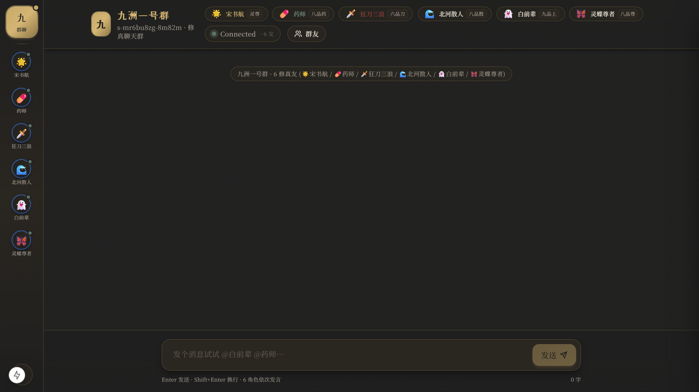

# Jiuzhou Group Chat · 九州一号群

[中文 README](README.zh-CN.md) · [GitHub](https://github.com/Player-YN/jiuzhou-groupchat)

**A persistent social simulation:** one human lives in a group chat with six fixed novel characters. They speak — or stay silent — because of scored motive, not because a wrapper asked six chatbots to take turns.

> Not a multi-agent brainstormer. Not a meeting-minutes bot. Silence is a first-class outcome.



## Why this is not a chatbot wrapper

A typical “six NPCs in a room” demo lets an LLM pick who talks, or round-robins everyone. This project separates **semantics** from **policy**:

| Layer | Who | What it is allowed to do |
| --- | --- | --- |
| Feature extract | Heuristic rules (default) or one batched LLM call | Output 0–3 scores for six roles. **Never names a speaker.** |
| Policy | Pure `BehaviorEngine.decide()` | Hard gates, weighted score, threshold, 0–2 arbitration, silence. |
| Memory of the decision | SQLite `DecisionLogStore` | Append-once. Same `event_id` + different input → collision. |
| Replay | Same engine, logged inputs only | Re-run **rules**, not the LLM. Field-equal or fail. |

Explicit `@mention` and DM never wait on an LLM assessor. Ordinary group events may select **zero, one, or two** speakers. Idle ticks select **at most one**. Autonomous chains stop at depth 3.

## Cast

| Key | Name | Voice (default provider) |
| --- | --- | --- |
| `shu-hang` | 宋书航 | Curious protagonist · MiniMax |
| `yao-shi` | 药师 | Spare, clinical alchemist · MiniMax |
| `san-lang` | 狂刀三浪 | Loud blade-cultivator · MiniMax |
| `bei-he` | 北河散人 | Steady elder / mediator · Agnes |
| `bai-qianbei` | 白前辈 | Cryptic senior · Agnes |
| `ling-die` | 灵蝶尊者 | Elegant, sharp · MiniMax |

Sidebar **ContactList** opens **DM**. A group-bubble **avatar** opens the **profile** card. Profile “voice / video” buttons are **UI stubs** (`暂未开放`) — there is **no A/V signaling**.

## Architecture

```
┌──────────────────────────────────────────────────────────┐
│  Electron shell  (start-electron.bat, two-phase)         │
│  phase 1: lifecycle → :8000 FastAPI + :3000 Next.js      │
│  phase 2: electron . --no-spawn  (window only)           │
│  close window → kill backend + frontend (no stop.bat)    │
└────────────────────────────┬─────────────────────────────┘
                             │  WS /ws/{session_id}
                             ▼
┌──────────────────────────────────────────────────────────┐
│  FastAPI  ·  stream_group_chat / stream_dm_chat          │
│  BehaviorEvent → assess (6 roles, one batch)             │
│                → BehaviorEngine.decide()  0..2           │
│                → serial generation + WS stream           │
└────────────────────────────┬─────────────────────────────┘
                             │
          ┌──────────────────┼──────────────────┐
          ▼                  ▼                  ▼
   Letta (optional      per-role LLM      SQLite stores
   long-term NPC        MiniMax / Agnes   memory + decisions
   agents)              / OpenAI / …      (append-once)
```

The LangGraph supervisor / 6–8-round cycle in `backend/app/graph.py` is **legacy compatibility**. The live group path is event-driven `stream_group_chat`.

Proactive speech is a process-wide **`BehaviorCoordinator` singleton** (`get_behavior_coordinator()`). When `GC_LOOPS_ENABLED` is true (default), the old random `XiuzhenCronService` stays **dormant** and the six `NpcLoop`s are **not** the online policy. Idle interval: 20–55 s. Daily per-role budget: `GC_DAILY_BUDGET` (default 60).

## Hybrid behavior engine

```text
semantic = 0.24·relevance + 0.20·social_obligation
         + 0.14·relationship_motivation + 0.14·continuity
         + 0.10·persona_impulse + 0.18·novelty_potential

final = clamp(semantic + deterministic adjustments)
```

Live defaults (env-tunable, **not** the older PRD 0.60 / 0.12 numbers):

| Knob | Default | Role |
| --- | --- | --- |
| `BEHAVIOR_ASSESS_MODE` | `heuristic` | Fast rule features. `@` **never** uses LLM assess. `llm` restores the six-role feature call. |
| `BEHAVIOR_RESPONSE_THRESHOLD` | `0.40` | Below this → eligible but not selected. |
| `BEHAVIOR_SECOND_MAX_GAP` | `0.28` | Second speaker only if close, `novelty_potential ≥ 1`, distinct `contribution_key`. |
| `BEHAVIOR_IDLE_MIN/MAX_SEC` | `20` / `55` | Coordinator idle stimulus. |
| `BEHAVIOR_COOLDOWN_SEC` | `25` | Ordinary proactive cooldown (`@` can override). |
| Hard gates | mute / sleep / busy / already handled / daily budget | Beat `@`. Cooldown does not. |

`proposed_action=react` is recorded and **not** promoted to a full reply (no lightweight reaction protocol yet).

**Audit (replayable):**

- `GET /api/behavior/decisions/{event_id}`
- `GET /api/behavior/decisions?session_id=…`
- `POST /api/behavior/decisions/{event_id}/replay` — re-run `decide()` only

Inject a non-user stimulus: `POST /api/cron/trigger` with `{"service":"behavior","behavior_event_type":"idle_tick","text":"…"}`.

## Stack

| Layer | Tech |
| --- | --- |
| Desktop | Electron 34 · `desktop-electron/main.cjs` · `--no-spawn` after lifecycle |
| UI | Next.js 15.1.3 · React 19 · Tailwind 3.4 · deep-ink-gold theme |
| API | Python 3.11+ · FastAPI 0.115+ · Uvicorn · WebSockets |
| Agents | LangChain / LangGraph (generation + unused legacy graph) · optional Letta |
| Store | SQLite via SQLModel — `agent_memory`, `behavior_decisions` (MVP; no prod migration) |
| LLM | MiniMax / Agnes (per-role) · OpenAI / DeepSeek / Anthropic / Ollama · `USE_MOCK_LLM` |

Context: last 20 messages kept; older turns optionally summarized (MiniMax). Generation: 90 s wall clock, 600-char hard cap.

## Run

**Real entry — this only:**

```bat
start-electron.bat
```

Optional: `start-electron.bat debug` (visible host + `desktop-electron/launch.log`) · `start-electron.bat rebuild` (frontend rebuild, then start).

Two-phase launch (`scripts/start-electron.ps1` + `scripts/groupchat-lifecycle.ps1`):

1. Start / reuse FastAPI `:8000` and Next `:3000` (orphan ports cleared; `frontend/public/runtime-config.js` written by lifecycle).
2. Open Electron with `--no-spawn`. Closing the window runs lifecycle **stop** and releases both ports.

Do not treat `uvicorn` / `next dev` / Tauri `desktop-launcher` as the product entry.

Keys live in a **gitignored** `.env` (repo root or `backend/.env`). Admin ⚙ (`POST /api/admin/config`) writes provider + key into that file — **never commit it**. No key → mock provider.

| Variable | Meaning |
| --- | --- |
| `USE_MOCK_LLM` | Force mock; beats Letta and real providers. |
| `USE_LETTA` | Default true. Mock still wins. Letta down → per-role fallback. |
| `GC_LOOPS_ENABLED` | Default true → start `BehaviorCoordinator`. `false` → legacy cron. |
| `MINIMAX_API_KEY` / `AGNES_API_KEY` / … | Per-provider keys. |

## Tests

```powershell
cd backend
uv run ruff check app tests
uv run pytest tests/test_behavior_engine.py tests/test_behavior_coordinator.py tests/test_behavior_audit.py tests/test_group_behavior_integration.py -q

cd ..\frontend
npx tsc --noEmit
```

Covered in those files: natural silence, 0–2 cap, `@` floor without LLM, mute vs `@`, distinct `contribution_key`, cooldown / budget, depth-3 stop, append-once log, deterministic replay, coordinator singleton (one idle → one batch → ≤1 speaker), duplicate `event_id`.

A 24-hour soak runner exists (`backend/tests/soak_mvp_candidate.py`). **It is not a passed product gate.** Human scenario acceptance (`docs/product/05_MVP_SCENARIO_ACCEPTANCE.md`) is also **pending**.

## Honest feature flags

| Surface | Live default | Notes |
| --- | --- | --- |
| Wallpaper | Static CSS `.chat-wallpaper` (deep ink / gold) | `frontend/public/backgrounds/chat-ink-xianxia.png` is on disk, **not referenced**. |
| World Stage / weather | **Off, and not mounted** | Modules exist under `frontend/lib/world` + `frontend/components/world`. Flag: `NEXT_PUBLIC_WORLD_STAGE=1`, `?worldStage=1`, `localStorage xz-world-stage`. `ChatRoom` / `layout` / `page` do **not** import `AppAtmosphere` / `WorldStage` / the debug wheel. Admin ⚙ has **no** “动态舞台” toggle. Rain/snow is not a product default. |
| Voice / video | Stub buttons | Toast only. No WebRTC / signaling. |
| LangGraph cycle | Not online | `stream_group_chat` uses the engine. |
| `NpcLoop` × 6 | Compatibility only | Must not become the default proactive path. |
| Postgres | Not integrated | SQLite only. |
| Multi-human group | Out of scope | One human + six NPCs. |

## Status

Stage: **Stage10-World-Stage** on `main`. Engineering candidate: event-driven scoring, silence, `@`/DM fallbacks, idempotent audit replay, single coordinator.

**Not claimed done:** 24 h soak, full human acceptance, packaged offline installer, real A/V, production DB.

Product source of truth: [`docs/product/04_MVP_CANDIDATE_PRD.md`](docs/product/04_MVP_CANDIDATE_PRD.md) · evidence: [`06_MVP_COMPLETION_AUDIT.md`](docs/product/06_MVP_COMPLETION_AUDIT.md). Threshold numbers in the PRD may lag the env defaults above — **code wins**.

## Docs

- [`AGENTS.md`](AGENTS.md) — current operating index
- [`docs/README.md`](docs/README.md) — doc map
- [`docs/decisions/0007-npc-self-driven.md`](docs/decisions/0007-npc-self-driven.md) — proactive-speech ADR
- [`docs/screenshots/`](docs/screenshots/) — visual evidence
