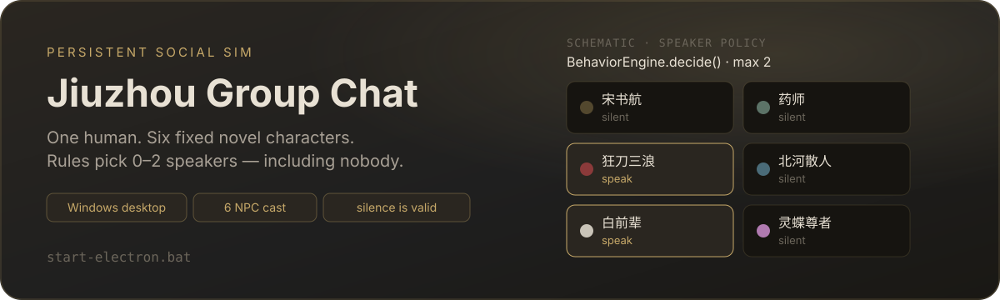
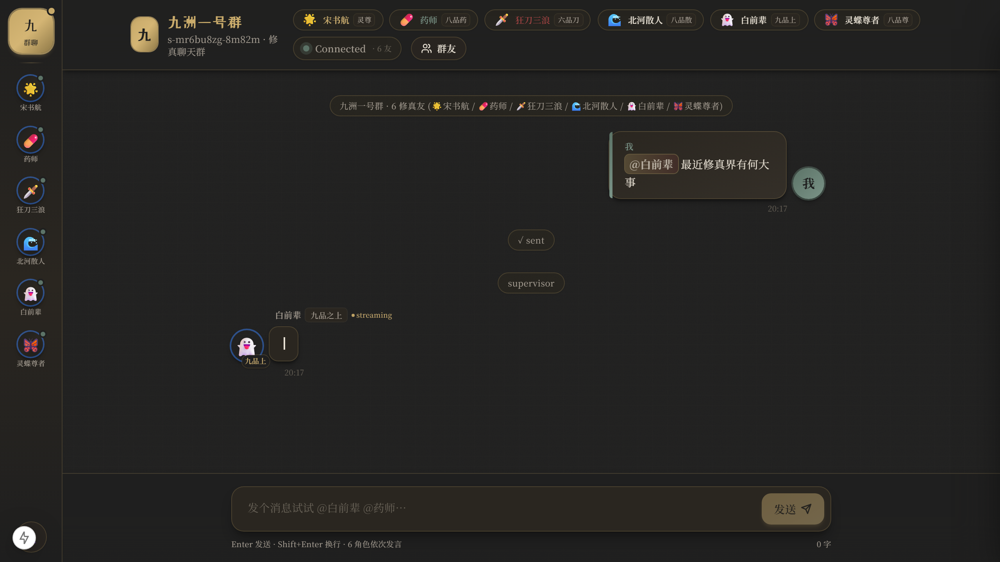

<p align="center">
  
</p>

<p align="center">
  <a href="README.zh-CN.md">中文 README</a>
  ·
  <a href="https://github.com/Player-YN/jiuzhou-groupchat">GitHub</a>
  ·
  <a href="LICENSE">MIT</a>
</p>

**A persistent social simulation** for people who want a group that can stay quiet. One human lives with six fixed novel characters. After each event, **`BehaviorEngine.decide()`** — not an LLM — selects **zero, one, or two** speakers.

**This is not** a six-chatbot round-robin, a multi-agent brainstormer, a meeting-minutes bot, or a voice/video client. Profile “voice / video” buttons are UI stubs. The LangGraph supervisor in `backend/app/graph.py` is **legacy**, not the live group path.

## Run

**Official path — this only** (Windows desktop):

```bat
start-electron.bat
```

Double-click it. Lifecycle starts FastAPI `:8000` and Next.js `:3000`, then opens Electron. Closing the window stops both processes. Log: `desktop-electron/launch.log`.

Optional flags (same file): `start-electron.bat debug` · `start-electron.bat rebuild`.

Do **not** treat standalone `uvicorn`, `next dev`, or `docker compose` as the product entry.

No API key → mock provider. Keys go in a **gitignored** `.env` (repo root or `backend/.env`). Admin ⚙ writes that file — never commit it.

<p align="center">
  
</p>

An `@mention` selects its target without waiting on an LLM assessor. Ordinary group events may produce **0 / 1 / 2** replies. Idle ticks select **at most one**. Autonomous chains stop at depth 3.

## What it is not

| Surface | Live default | Honesty |
| --- | --- | --- |
| Voice / video | Stub buttons | Toast only. **No** WebRTC / signaling. |
| Speaker picker | `BehaviorEngine.decide()` | LLM/heuristics extract 0–3 features. They **never** name a speaker. |
| LangGraph cycle | Not online | Live path is event-driven `stream_group_chat`. |
| `NpcLoop` × 6 | Compatibility only | Must not become the default proactive path. |
| World Stage / weather | Off, not mounted | Modules exist; `ChatRoom` / `layout` / `page` do not import them. Rain/snow is not a product default. |
| Wallpaper | Static CSS `.chat-wallpaper` | Deep ink / gold. `chat-ink-xianxia.png` is on disk, **not referenced**. |
| Multi-human group | Out of scope | One human + six NPCs. |
| Postgres / packaged installer | Not shipped | SQLite only. No offline Electron installer. |

## How speakers are chosen

Semantics and policy are split on purpose:

| Layer | Who | Allowed to do |
| --- | --- | --- |
| Feature extract | Heuristic rules (default) or one batched LLM call | Output 0–3 scores for six roles. **Never names a speaker.** |
| Policy | Pure `BehaviorEngine.decide()` | Hard gates, weighted score, threshold, 0–2 arbitration, silence. |
| Decision memory | SQLite `DecisionLogStore` | Append-once. Same `event_id` + different input → collision. |
| Replay | Same engine, logged inputs only | Re-run **rules**, not the LLM. Field-equal or fail. |

```text
semantic = 0.24·relevance + 0.20·social_obligation
         + 0.14·relationship_motivation + 0.14·continuity
         + 0.10·persona_impulse + 0.18·novelty_potential

final = clamp(semantic + deterministic adjustments)
```

Live defaults (env-tunable; **not** older PRD 0.60 / 0.12 numbers):

| Knob | Default | Role |
| --- | --- | --- |
| `BEHAVIOR_ASSESS_MODE` | `heuristic` | Fast rule features. `@` **never** uses LLM assess. `llm` restores the six-role feature call. |
| `BEHAVIOR_RESPONSE_THRESHOLD` | `0.40` | Below this → eligible but not selected. |
| `BEHAVIOR_SECOND_MAX_GAP` | `0.28` | Second speaker only if close, `novelty_potential ≥ 1`, distinct `contribution_key`. |
| `BEHAVIOR_IDLE_MIN/MAX_SEC` | `20` / `55` | Coordinator idle stimulus. |
| `BEHAVIOR_COOLDOWN_SEC` | `25` | Ordinary proactive cooldown (`@` can override). |
| Hard gates | mute / sleep / busy / already handled / daily budget | Beat `@`. Cooldown does not. |

`proposed_action=react` is recorded and **not** promoted to a full reply (no lightweight reaction protocol yet).

Audit:

- `GET /api/behavior/decisions/{event_id}`
- `GET /api/behavior/decisions?session_id=…`
- `POST /api/behavior/decisions/{event_id}/replay` — re-run `decide()` only

Inject a non-user stimulus: `POST /api/cron/trigger` with `{"service":"behavior","behavior_event_type":"idle_tick","text":"…"}`.

## Cast

| Key | Name | Voice (default provider) |
| --- | --- | --- |
| `shu-hang` | 宋书航 | Curious protagonist · MiniMax |
| `yao-shi` | 药师 | Spare, clinical alchemist · MiniMax |
| `san-lang` | 狂刀三浪 | Loud blade-cultivator · MiniMax |
| `bei-he` | 北河散人 | Steady elder / mediator · Agnes |
| `bai-qianbei` | 白前辈 | Cryptic senior · Agnes |
| `ling-die` | 灵蝶尊者 | Elegant, sharp · MiniMax |

Sidebar **ContactList** opens **DM**. A group-bubble **avatar** opens the **profile** card.

## Architecture

```
┌──────────────────────────────────────────────────────────┐
│  Electron shell  (start-electron.bat, two-phase)         │
│  phase 1: lifecycle → :8000 FastAPI + :3000 Next.js      │
│  phase 2: electron . --no-spawn  (window only)           │
│  close window → kill backend + frontend (no stop.bat)    │
└────────────────────────────┬─────────────────────────────┘
                             │  WS /ws/{session_id}
                             ▼
┌──────────────────────────────────────────────────────────┐
│  FastAPI  ·  stream_group_chat / stream_dm_chat          │
│  BehaviorEvent → assess (6 roles, one batch)             │
│                → BehaviorEngine.decide()  0..2           │
│                → serial generation + WS stream           │
└────────────────────────────┬─────────────────────────────┘
                             │
          ┌──────────────────┼──────────────────┐
          ▼                  ▼                  ▼
   Letta (optional      per-role LLM      SQLite stores
   long-term NPC        MiniMax / Agnes   memory + decisions
   agents)              / OpenAI / …      (append-once)
```

Proactive speech is a process-wide **`BehaviorCoordinator` singleton**. When `GC_LOOPS_ENABLED` is true (default), the old random `XiuzhenCronService` stays **dormant**. Daily per-role budget: `GC_DAILY_BUDGET` (coordinator default 60).

Two-phase launch (`scripts/start-electron.ps1` + `scripts/groupchat-lifecycle.ps1`): start or reuse the two ports (orphans cleared; `frontend/public/runtime-config.js` written), then open the window with `--no-spawn`.

| Variable | Meaning |
| --- | --- |
| `USE_MOCK_LLM` | Force mock; beats Letta and real providers. |
| `USE_LETTA` | Default true. Mock still wins. Letta down → per-role fallback. |
| `GC_LOOPS_ENABLED` | Default true → start `BehaviorCoordinator`. `false` → legacy cron. |
| `MINIMAX_API_KEY` / `AGNES_API_KEY` / … | Per-provider keys. |

## Stack

| Layer | Tech |
| --- | --- |
| Desktop | Electron 34 · `desktop-electron/main.cjs` · `--no-spawn` after lifecycle |
| UI | Next.js 15.1.3 · React 19 · Tailwind 3.4 · deep-ink-gold theme |
| API | Python 3.11+ · FastAPI 0.115+ · Uvicorn · WebSockets |
| Agents | LangChain / LangGraph (generation + unused legacy graph) · optional Letta |
| Store | SQLite via SQLModel — `agent_memory`, `behavior_decisions` (MVP; no prod migration) |
| LLM | MiniMax / Agnes (per-role) · OpenAI / DeepSeek / Anthropic / Ollama · `USE_MOCK_LLM` |

Context: last 20 messages kept; older turns optionally summarized (MiniMax). Generation: 90 s wall clock, 600-char hard cap.

## Tests

```powershell
cd backend
uv run ruff check app tests
uv run pytest tests/test_behavior_engine.py tests/test_behavior_coordinator.py tests/test_behavior_audit.py tests/test_group_behavior_integration.py -q

cd ..\frontend
npx tsc --noEmit
```

Those files cover: natural silence, 0–2 cap, `@` floor without LLM, mute vs `@`, distinct `contribution_key`, cooldown / budget, depth-3 stop, append-once log, deterministic replay, coordinator singleton (one idle → one batch → ≤1 speaker), duplicate `event_id`.

A 24-hour soak runner exists (`backend/tests/soak_mvp_candidate.py`). **It is not a passed product gate.** Human scenario acceptance (`docs/product/05_MVP_SCENARIO_ACCEPTANCE.md`) is also **pending**.

## Status

Stage: **Stage10-World-Stage** on `main`. Engineering candidate: event-driven scoring, silence, `@`/DM fallbacks, idempotent audit replay, single coordinator.

**Not claimed done:** 24 h soak, full human acceptance, packaged offline installer, real A/V, production DB.

Product source of truth: [`docs/product/04_MVP_CANDIDATE_PRD.md`](docs/product/04_MVP_CANDIDATE_PRD.md) · evidence: [`06_MVP_COMPLETION_AUDIT.md`](docs/product/06_MVP_COMPLETION_AUDIT.md). Threshold numbers in the PRD may lag the env defaults above — **code wins**.

## Docs

- [`AGENTS.md`](AGENTS.md) — current operating index
- [`docs/README.md`](docs/README.md) — doc map
- [`docs/decisions/0007-npc-self-driven.md`](docs/decisions/0007-npc-self-driven.md) — proactive-speech ADR
- [`docs/screenshots/`](docs/screenshots/) — visual evidence

## License

[MIT](LICENSE) · Copyright (c) 2026 Player-YN
