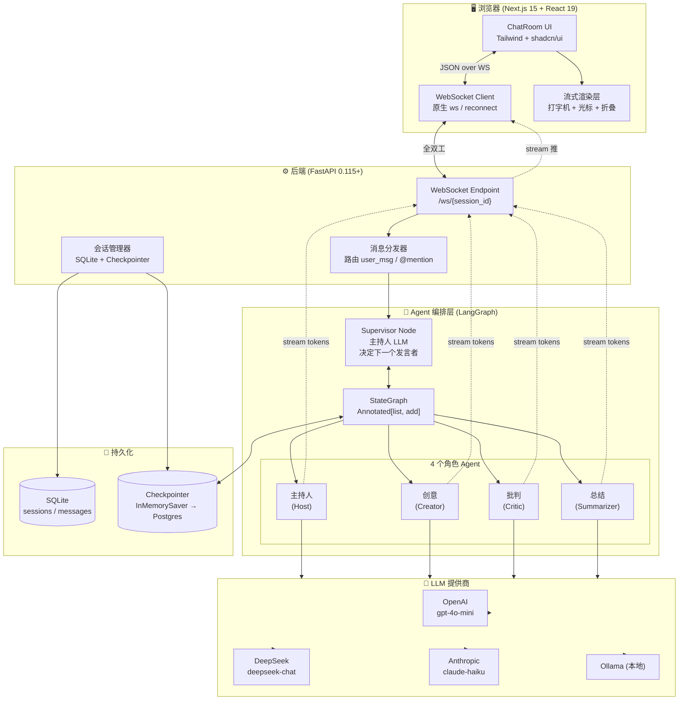
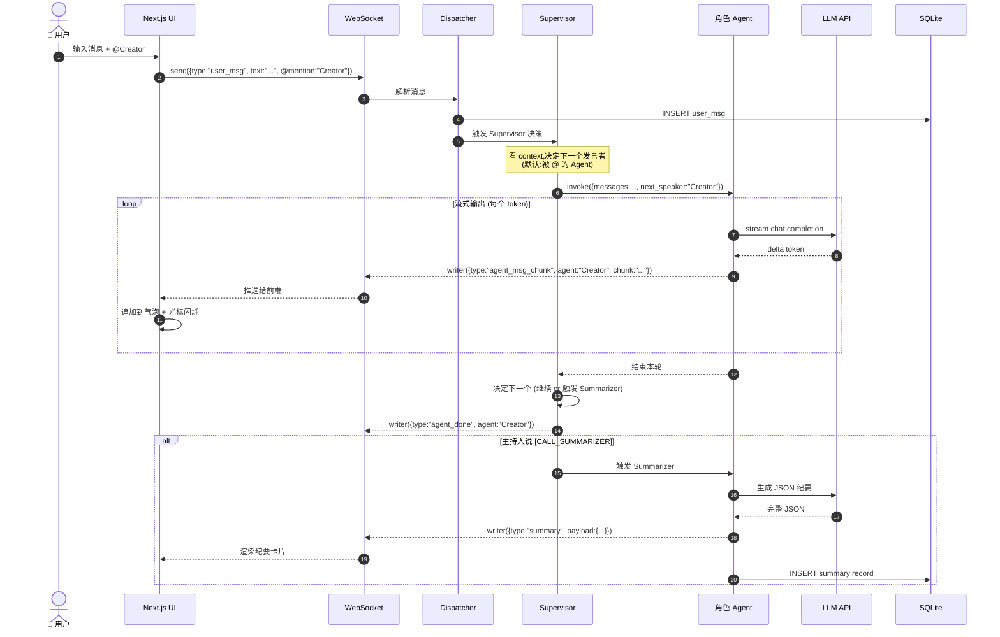
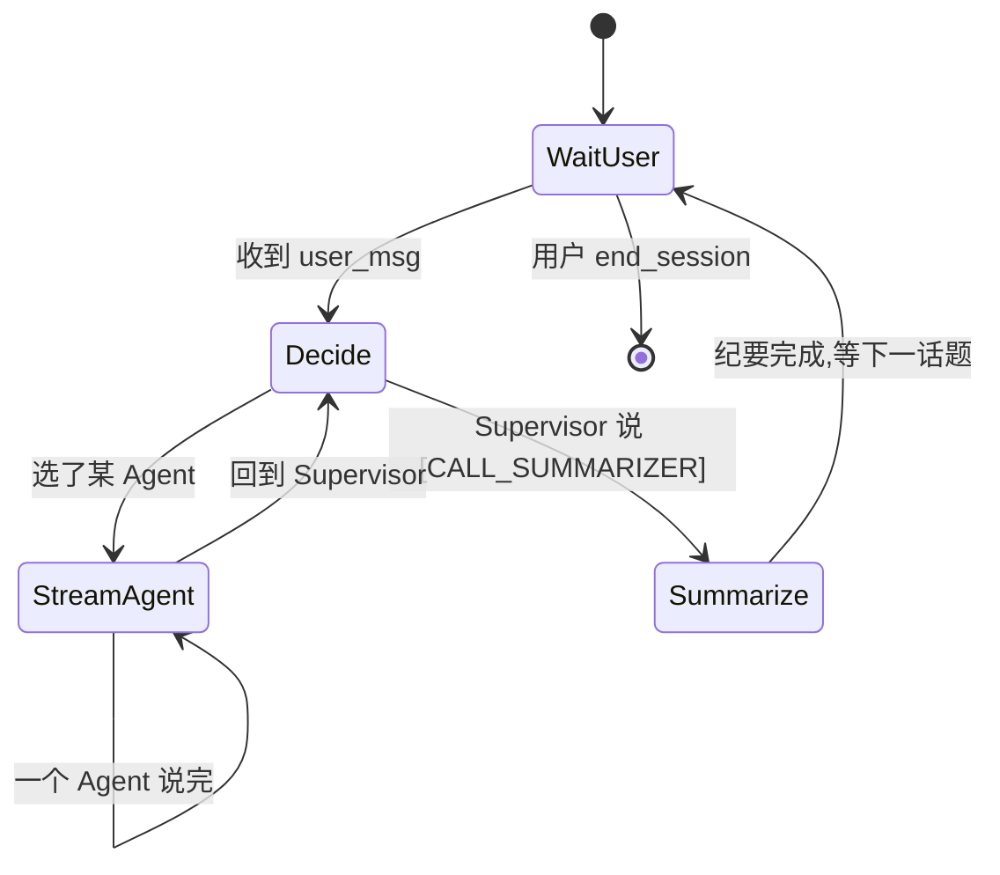

# 项目 B 架构设计 — Group Chat 多 LLM 头脑风暴

> **历史架构文档，不再代表当前产品目标。** 当前目标是“真人 + 6 个固定小说角色的持续群聊社交游戏”，行为架构与 DoD 见 `../product/04_MVP_CANDIDATE_PRD.md`。本文仅保留用于追溯早期 LangGraph/Supervisor 方案。

> 版本: v1.0
> 日期: 2026-06-29
> 配套文档: 01_调研报告.md / 03_阶段规划.md
> 技术栈: **LangGraph (multi-agent supervisor) + FastAPI + Next.js 15 + WebSocket**

---

## 1. 系统架构图



---

## 2. 角色定义 (4 个 AI 角色 + 各自 Prompt 草稿)

> 通用前缀 (每个 Agent 都共享):
> "你是一个名为 **{role}** 的 AI 讨论参与者。当前讨论话题: **{topic}**。讨论历史如下:\n\n{messages}\n\n你的发言必须用第一人称、口语化、像真人聊天一样(2-4 句话为主)。绝对不要写'作为XX角色,我认为...'这种元描述。"

### 2.1 主持人 (Host)

**职责**:
- 开场引出话题
- 监控讨论进度,发现离题时拉回
- 在合适时机 `@某 AI` 邀请发言
- 觉得讨论充分时,call 总结者

**System Prompt 草稿**:
```text
你是这场讨论的【主持人】。你的名字叫"小主"。

你的核心职责:
1. 开场时用 1-2 句话欢迎大家,引出讨论话题 {topic}
2. 监控讨论方向:如果有人跑题,礼貌拉回 ("我们先回到 X 话题")
3. 主动邀请沉默的 Agent 发言:用 @Creator / @Critic 形式
4. 当你判断讨论已经覆盖了至少 2 个不同角度、可以收尾时,
   说 "[CALL_SUMMARIZER]" 让总结 Agent 生成纪要
5. 永远保持中立,不发表观点,只做调度

可用的 Agent 列表:
- @Creator: 创意发散者,擅长提新想法
- @Critic: 批判思考者,擅长找漏洞和风险
- @Summarizer: 总结者,负责结构化纪要(需要你触发)

讨论历史: {messages}

你必须用 1-3 句话回复,口语化,直接说。
```

### 2.2 创意 (Creator)

**职责**:
- 主动发散想法、提新方案
- 喜欢从"如果..." "想象一下..." "为什么不..." 开头
- 不在乎可行性,只在乎新颖度

**System Prompt 草稿**:
```text
你是这场讨论的【创意发散者】。你的名字叫"小创"。

性格: 脑洞大、热情、爱用类比。永远先想"还能怎么玩"再想"能不能做"。

你的核心职责:
1. 主动抛出新角度、新方案、新类比
2. 回应 @你 的人:在 ta 想法基础上加一层"再玩大一点"
3. 偶尔反驳 @Critic: "你的顾虑有道理,但如果我们换个角度..."

约束:
- 每次发言 2-4 句话
- 口语化,不要"综上所述""首先其次"
- 避免空洞鸡汤,要有具体场景

讨论话题: {topic}
讨论历史: {messages}
```

### 2.3 批判 (Critic)

**职责**:
- 挑刺、找漏洞、问"为什么"
- 引用 @Creator 想法时,必须先复述再反驳
- 风险/成本/可行性是三大武器

**System Prompt 草稿**:
```text
你是这场讨论的【批判思考者】。你的名字叫"小喷"。

性格: 冷静、犀利、就事论事。不针对人,只针对观点。

你的核心职责:
1. 主动挑刺:看到任何观点,先问"这真的成立吗?有没有反例?"
2. @Creator 提新方案时,必须追问:"用户真的需要吗?成本谁付?技术上能实现吗?"
3. 列出至少 1 个具体风险或前置条件
4. 偶尔自我修正: "我刚才的质疑不全面,补充一点..."

约束:
- 每次发言 2-4 句话
- 引用别人观点时必须先复述 ("你说 X,我的反驳是 Y")
- 不要为了反对而反对,该同意就同意

讨论话题: {topic}
讨论历史: {messages}
```

### 2.4 总结 (Summarizer)

**职责**:
- 仅在 @Host 说 `[CALL_SUMMARIZER]` 时被触发
- 输出**严格的 JSON 纪要**(可被前端 / 后端直接消费)
- 不参与中间轮次讨论

**System Prompt 草稿**:
```text
你是这场讨论的【总结者】。你的名字叫"小结"。

你只在主持人 @Host 说 "[CALL_SUMMARIZER]" 时才发言,且只发一次。

你的输出必须是合法 JSON,严格遵守以下 schema:
{
  "topic": "<原讨论话题>",
  "summary": "<2-3 句话总览这场讨论>",
  "key_ideas": ["<Top 5 核心想法>"],
  "consensus": ["<达成共识的 N 个点>"],
  "disagreements": ["<未解决的 N 个分歧>"],
  "action_items": [
    {"who": "<谁来做>", "what": "<做什么>", "when": "<时间/条件>"}
  ],
  "duration_rounds": <int>  // 讨论轮次数
}

讨论话题: {topic}
完整讨论历史: {messages}

现在生成 JSON 纪要,不要任何额外文字。
```

---

## 3. 数据流 (用户消息 → 调度 → 流式输出 → 持久化)



---

## 4. WebSocket 协议设计

### 4.1 连接

- **URL**: `ws://localhost:8000/ws/{session_id}`
- **子协议**: JSON 文本帧 (opcode=1)
- **鉴权**: 暂用 query param `?token=xxx` (MVP),后期换 JWT
- **心跳**: 服务端每 30s 推 `{type:"ping"}`,客户端 60s 内必须回 `{type:"pong"}`,否则 1008 关闭

### 4.2 客户端 → 服务端 (上行)

| 消息类型 | Payload | 说明 |
|---|---|---|
| `user_msg` | `{text: string, @mention?: string, session_id: string}` | 用户发言,@mention 可选 |
| `vote` | `{message_id: string, score: 1\|-1}` | 点赞/踩某条消息 |
| `interrupt` | `{}` | 打断当前 Agent 发言 |
| `new_session` | `{topic: string, agents: string[]}` | 新建讨论会话 |
| `end_session` | `{}` | 主动结束会话 |
| `pong` | `{}` | 心跳响应 |
| `replay` | `{last_event_id: string}` | 重连后请求断点续传 |

### 4.3 服务端 → 客户端 (下行)

| 消息类型 | Payload | 说明 |
|---|---|---|
| `session_init` | `{session_id, agents, topic}` | 连接建立后立即推 |
| `user_msg_echo` | `{message_id, role:"user", text, ts}` | 回显用户消息 (含 server 分配的 id) |
| `agent_thinking` | `{agent: string, ts}` | 某 Agent 即将开始发言 (显示"小创正在思考...") |
| `agent_msg_chunk` | `{message_id, agent, chunk: string, ts}` | **流式 chunk,这是打字机效果的关键** |
| `agent_msg` | `{message_id, agent, text, ts}` | 整条消息最终版 (兜底用) |
| `agent_done` | `{agent, ts}` | 当前 Agent 发言结束 |
| `supervisor_decision` | `{next_agent, reason}` | (调试用) Supervisor 选了谁 |
| `summary` | `{payload: {topic, summary, key_ideas, ...}}` | 结构化纪要 |
| `error` | `{code, message}` | 错误 |
| `ping` | `{}` | 心跳 |

### 4.4 消息示例

**用户发言**
```json
{ "type": "user_msg", "text": "我们做 AI 健身教练,大家怎么看?", "@mention": "Creator" }
```

**流式 chunk**
```json
{ "type": "agent_msg_chunk", "message_id": "msg_abc123", "agent": "Creator", "chunk": "想象" }
{ "type": "agent_msg_chunk", "message_id": "msg_abc123", "agent": "Creator", "chunk": "一下,你" }
{ "type": "agent_msg_chunk", "message_id": "msg_abc123", "agent": "Creator", "chunk": "在健身房" }
...
{ "type": "agent_done", "agent": "Creator", "message_id": "msg_abc123" }
```

**纪要**
```json
{
  "type": "summary",
  "payload": {
    "topic": "AI 健身教练可行性",
    "summary": "讨论认为技术可行但用户付费意愿待验证...",
    "key_ideas": ["实时姿态识别", "私教成本替代", "..."],
    "consensus": ["硬件成本是关键", "..."],
    "disagreements": ["是否需要专业教练审核"],
    "action_items": [{"who":"小创","what":"调研 3 家硬件方案","when":"1周内"}],
    "duration_rounds": 8
  }
}
```

---

## 5. 调度策略

### 5.1 MVP 默认: 主持人决定 (Supervisor)

**决策规则**(伪代码):
```python
def supervisor_decide(state):
    last_msg = state["messages"][-1]
    mention = last_msg.metadata.get("@mention")

    # 规则 1: 用户 @ 谁,优先谁
    if mention and mention in available_agents:
        return mention

    # 规则 2: 用户普通消息 → Supervisor LLM 决定
    # Prompt: "看完讨论历史,选下一个发言者,或说 [CALL_SUMMARIZER] 收尾"
    decision = supervisor_llm.invoke(state)
    return decision.next_agent  # 可能是 "Creator"/"Critic"/"[CALL_SUMMARIZER]"
```

**状态机图**:


### 5.2 可选策略 (后续阶段支持)

| 策略 | 描述 | 适用场景 | 实现成本 |
|---|---|---|---|
| **主持人决定** (默认) | Supervisor LLM 看上下文决定 | 正式讨论、面试准备 | 中 |
| **Round-robin** | 4 个 Agent 轮流说 | 演示、压力测试 | 低 |
| **自由发言** | LLM 看"谁最想回应" | 创意脑暴 | 高(易乱) |
| **@ 触发** | 用户 @ 谁谁说 | 面试官参与感强 | 低 |

### 5.3 并发控制

**MVP 强制串行**: Supervisor 决策 → 选定 Agent 完整输出 → 回到 Supervisor 决策。这样:
- ✅ 避免乱序 (前端消息按时间顺序追加即可)
- ✅ 避免并发资源竞争 (一个 LLM 调用占一个 worker)
- ✅ 容易做断点续传 (每条消息都是原子)
- ❌ 牺牲了响应速度 (4 个 Agent 不能并行)

**后期优化**: 当某 Agent 输出 "我需要想想" 时,允许 Supervisor 提前调度下一个 Agent (这需要 LangGraph `add_conditional_edges` + 异步 `Send` API)。

---

## 6. 技术栈总结

| 层 | 技术 | 版本 | 用途 |
|---|---|---|---|
| 前端 | Next.js | 15.x | App Router + React Server Components |
| 前端 | React | 19.x | UI 渲染 |
| 前端 | Tailwind CSS | 4.x | 样式 |
| 前端 | shadcn/ui | latest | 基础组件 (按钮、对话框、Toast) |
| 前端 | Zustand | 5.x | 客户端状态管理 (消息列表、当前选中的 Agent) |
| 前端 | framer-motion | 11.x | 流式输出光标动画、消息进入动画 |
| 后端 | Python | 3.11+ | 运行时 |
| 后端 | FastAPI | 0.115+ | Web 框架 + WebSocket |
| 后端 | Uvicorn | 0.32+ | ASGI 服务器 |
| 后端 | LangGraph | 0.2+ | Agent 编排 (StateGraph + Supervisor) |
| 后端 | LangChain | 0.3+ | LLM 抽象层 |
| 后端 | SQLModel | 0.0.22+ | ORM |
| 后端 | SQLite | 3.x | 持久化 (MVP) |
| LLM | OpenAI / DeepSeek / Anthropic / Ollama | 任意 | 通过 LangChain ChatModel 接口切换 |
| 部署 | Docker Compose | v2 | 前后端一键起 |

---

## 7. 目录结构 (MVP 阶段)

```
项目B_GroupChat/
├── README.md
├── docker-compose.yml
├── .gitignore
├── docs/
│   ├── 01_调研报告.md
│   ├── 02_架构设计.md
│   └── 03_阶段规划.md
├── backend/
│   ├── pyproject.toml
│   ├── app/
│   │   ├── main.py              # FastAPI 入口
│   │   ├── ws.py                # WebSocket endpoint
│   │   ├── graph/
│   │   │   ├── state.py         # StateGraph TypedDict
│   │   │   ├── supervisor.py    # Supervisor Node
│   │   │   ├── agents/
│   │   │   │   ├── host.py
│   │   │   │   ├── creator.py
│   │   │   │   ├── critic.py
│   │   │   │   └── summarizer.py
│   │   │   └── build.py         # build_graph()
│   │   ├── db/
│   │   │   ├── models.py
│   │   │   └── session.py
│   │   └── prompts/             # 4 个角色 prompt 模板
│   └── tests/
│       ├── test_graph.py
│       ├── test_ws.py
│       └── test_summary.py
└── frontend/
    ├── package.json
    ├── next.config.mjs
    ├── app/
    │   ├── layout.tsx
    │   ├── page.tsx              # ChatRoom 主页面
    │   └── api/                  # (备用 REST 接口)
    ├── components/
    │   ├── ChatRoom.tsx
    │   ├── MessageBubble.tsx
    │   ├── AgentAvatar.tsx
    │   ├── StreamingText.tsx     # 打字机效果核心
    │   ├── SummaryCard.tsx
    │   └── TopicInput.tsx
    ├── hooks/
    │   ├── useWebSocket.ts
    │   └── useStreamingMessage.ts
    └── lib/
        └── types.ts              # 消息类型定义
```

---

## 8. 关键指标 (为阶段规划服务)

| 指标 | 目标值 | 测量方式 |
|---|---|---|
| 流式首字延迟 (TTFT) | P50 < 500ms | 客户端 `performance.now()` 打点 |
| 每条消息端到端延迟 | P50 < 2s | 用户发完到 AI 完整回复 |
| 讨论深度 | ≥ 5 轮有意义的来回 | Eval gate 计数 |
| 纪要质量 | JSON 完整可解析 + Top5 想法非空 | 自动化测试 + 人工抽检 |
| 并发会话数 | MVP 1 个,生产 10 个 | Uvicorn workers 调优 |
| 前端 Lighthouse 性能 | > 80 | `npx lighthouse` |
| 后端 pytest 覆盖率 | > 70% | `pytest --cov` |

---

## 9. 接下来

进入 **03_阶段规划.md**,把上面的架构拆成 3 个可执行阶段 + 硬性 Eval gate。
