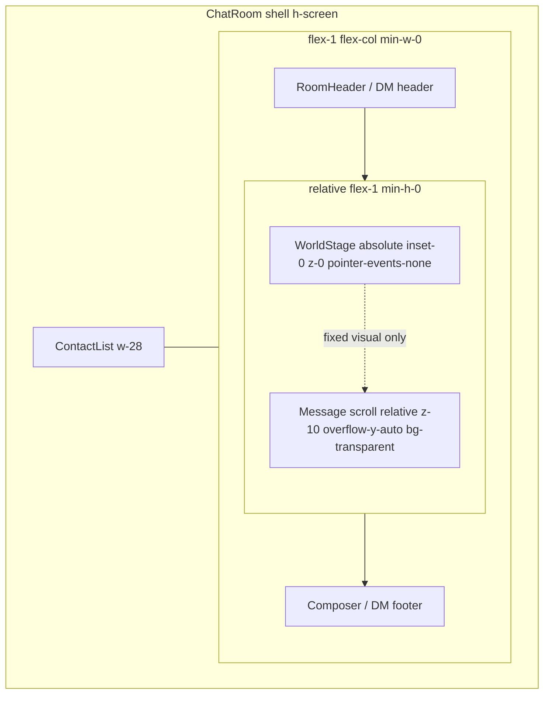
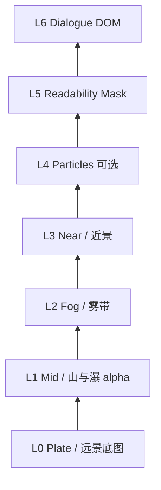
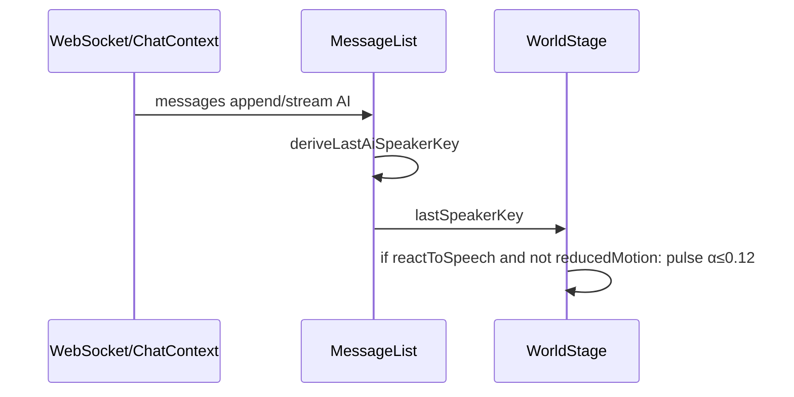

# World Stage Atmosphere — 九洲一号群「世界舞台」氛围层设计

| 字段 | 值 |
|------|-----|
| **Document** | `docs/design/world-stage-atmosphere.md` |
| **Author** | Design / Systems Architecture |
| **Date** | 2026-07-30 |
| **Status** | **Final**（Rev 2.2 — 产品决策冻结） |
| **Revision** | R2.2 2026-07-30：Admin「动态舞台」；`_source` 不进 git；PR5 绑真人验收；本阶段无 WebM |
| **Stage** | Stage10-Desktop-UX 延伸（氛围层，非剧情系统） |
| **Audience** | 前端、Electron、产品、资产制作 |
| **Related** | `AGENTS.md` §1、`docs/product/04_MVP_CANDIDATE_PRD.md`、`docs/research/visual-design-stage8.md`、`frontend/app/globals.css`、`frontend/components/ChatRoom.tsx`、`DMWindow.tsx` |

---

## 1. Overview / 概述

九洲一号群的定位已从「类 IM 聊天窗」明确为 **游戏化的对话式社交游戏**：用户与 6 个固定小说角色在同一持续世界里闲聊。对话内容已有可信群体感，但视觉舞台仍是 **挂在可滚动 `<main>` 上的单张静态壁纸**（`chat-ink-xianxia.png` + `.chat-wallpaper`），消息一多背景跟着滚，分辨率与层次感不足，读起来像「换了张聊天壁纸」，而不像 **固定的游戏世界舞台**。

本设计提出 **World Stage（世界舞台）**：在消息滚动区之下铺一层 **固定不滚动** 的多层 2D 氛围舞台（远山 / 中景雾 / 近景；可选粒子与 NPC 发言微光）。**首发路径以 CSS 固定多层为主**（即可交付「固定世界舞台」产品句）；**PixiJS v8 为门控增强**——仅当 CSS 雾/视差不足或产品明确要求粒子/发言 tint 时进入（见 K2、§11.3、§20 PR3）。目标不是做完整剧情/任务系统，而是让打开窗口的 3 秒内感到「我在九洲世界的一处场景里对话」，同时 **气泡与非气泡 chrome 的可读性、Electron 性能不被牺牲**。

---

## 2. Background & Motivation / 背景与动机

### 2.1 当前实现（代码事实）

| 项 | 现状 |
|----|------|
| 壁纸样式 | `frontend/app/globals.css` → `.chat-wallpaper` |
| 背景资源 | `frontend/public/backgrounds/chat-ink-xianxia.png`（约 215 KB / 220 411 bytes，单层水墨山水） |
| 挂载点 | `ChatRoom.tsx` MessageList 内 `<main className="chat-wallpaper flex-1 overflow-y-auto …">`；`DMWindow.tsx` 同样模式 |
| 滚动行为 | `background-attachment: local` —— **背景随消息列表滚动**（注释写明为规避 Electron fixed 失效） |
| 可读遮罩（生产） | `.chat-wallpaper` 线性渐变约 **top 0.38 / mid 0.28 / bottom 0.42**（`globals.css` 中 `rgba(31,31,31,0.38→0.28→0.42)`） |
| 气泡与墙纸关系 | AI/用户气泡主体多为 **不透明或高不透明 panel**（`bg-xz-panel` 等）——**墙纸对比风险主要集中在非气泡 chrome**（空状态文案、TimeGroupDivider、系统 pill、角色名/回复链标签等），而非气泡正文 |
| 主题 | 深墨金 CSS 变量（`#1F1F1F` / `#C7A969` / 角色色）；body 另有固定纹理 |
| 依赖 | `frontend/package.json`：**无** Pixi / Canvas 库，仅 Next 15.1.3 + React 19 + Tailwind；含 `playwright` |
| 桌面壳 | `desktop-electron/main.cjs`：固定窗 **1200×780**，`backgroundColor: '#1F1F1F'`，无硬件加速特殊开关 |
| 布局几何 | `ContactList` 为 `w-28`（112px）；消息舞台 ≠ 整窗、**≠ 16:9**；`DailyDaoYan` 在 header 与消息区之间 |
| 产品边界 | PRD「明确停止扩张」含「大规模 UI 重做」——本方案定位为 **氛围层定点升级**，不改行为引擎、不做任务系统 |

### 2.2 痛点

1. **结构像 IM，不像舞台**：壁纸绑在 scroll container 上，长对话后「世界」跟着字滚走，破坏持久场景感。
2. **单层静态**：无视差、无雾动、无微粒，低分辨率放大后糊，且与深墨金 UI 叠在一起容易「脏」。
3. **产品叙事错位**：角色是修仙群友，UI 已是深墨金，背景却只是「好看壁纸」级别，未支撑「游戏化对话」定位。
4. **Electron 约束未系统化**：`local` attachment 是权宜之计；真正的 fixed stage 应是 **独立层 + 消息层滚动**，而不是 CSS background 技巧。

### 2.3 产品一句话目标

> 用户看到的是 **固定世界舞台 + 滚动对话字幕/气泡**，而不是 **带壁纸的微信会话**。

---

## 3. Goals & Non-Goals / 目标与非目标

### 3.1 Goals

1. **固定舞台**：消息滚动时背景层几何位置不变（微信式：舞台固定、内容滚动）。
2. **多层氛围**：至少 3 逻辑层（远 / 中 / 近），可选粒子与极轻视差。
3. **可读优先**：非气泡 chrome + 气泡均不劣化；遮罩可配置；空状态与长消息均清晰（见 §5.7 验收表）。
4. **性能预算**：Electron 1200×780 常驻可接受；见 §11 Performance Budgets。
5. **无障碍**：`prefers-reduced-motion: reduce` 时停舞台动效，退回静态构图。
6. **可开关**：feature flag 可关闭多层/动效/Pixi，**仍保留 PR1 固定舞台结构**（见 K12）；支持侧一句话可操作。
7. **资产可替换**：目录约定 + manifest，不硬编码单张 PNG 路径。
8. **回答资产全链路**：来源、归属、prompt、导出管线、组件落地路径。

### 3.2 Non-Goals（本阶段不做）

- 完整剧情 / Quest / 地图切换 / 战斗养成（PRD 停止扩张）。
- 3D（Three.js）或全屏 live wallpaper 级视频循环（可选 WebM 为 Phase 2，非必达）。
- 音视频信令、真实场景同步服务器。
- 每角色独立场景（首发 **共享场景 + 数值 intensity 区分群/DM**；第二场景 id 仅预留类型，不阻塞首发）。
- 运行时由后端 LLM 动态生成背景图。
- 改写 `BehaviorEngine` / Coordinator 逻辑。
- **不**在本阶段改造全局已有动画（`goldShimmer`、NPC reveal 等）——舞台 a11y 只约束 World Stage 自身。

---

## 4. Key Decisions / 关键决策

| # | 决策 | 选择 | 理由 |
|---|------|------|------|
| K1 | 舞台 vs 壁纸结构 | **独立固定层 + 透明滚动消息层**（类微信） | 解决「背景跟着滚」；比修 CSS `background-attachment` 更稳 |
| K2 | 渲染技术 | **首发/默认可为 CSS 多层**；**PixiJS v8 为门控目标渲染器**。`engine="auto"` 决策见 §5.3.5 | Stage10 优先低风险；见 §11.3 |
| K3 | 资产形态 | **多图层 PNG（含 alpha）+ 可选粒子**；**不**把首版押在整段循环视频 | 可控、易换、体积小；视频作 Phase 2 |
| K4 | 资产来源 | **混合管线：AI 生成（xAI Imagine）+ 人工 QA/修图**；商用 stock 备胎 | 风格统一、迭代快；见 §6、§8.0 降级制作路径 |
| K5 | 生成主体 | **制作时** Agent/人产出 → 入库 `frontend/public/world/`；**不**在用户客户端实时生成 | 可版本化、可审计 |
| K6 | 发言响应 | **可选极轻**；**PR4 前 `reactToSpeech` 默认 `false`**；开启后 α 上限见 §5.7 | 可读优先；PR4 视觉 QA 后再考虑默认开 |
| K7 | 集成范围 | 群聊 + DM **同一 `sceneId`**；DM 仅 **`intensity={0.4}`**（群默认 `0.55`）；映射见 §5.3.1.1 | 类型单一；Open Q#1 冻结 |
| K8 | 与 PRD 关系 | **Stage10 UX 氛围补丁**，非「大规模 UI 重做」 | 可独立 PR |
| K9 | 窗口坐标系 | 舞台对齐 **消息区 host**（非整窗）；图层统一 **cover + center**，地平线锚点约 **40% 高度** | host 非 16:9；见 §5.2.1 |
| K10 | 包体积 / 加载 | Pixi **仅** `useEffect` 内 dynamic import；flag 关则不加载；无 top-level `import "pixi.js"` | SSR 安全、首屏可控；见 §5.3.4 |
| K11 | Flag 默认 | 构建默认 **关**：`NEXT_PUBLIC_WORLD_STAGE === "1"` 才为 env 开启；**unset ≠ on**；PR5 改默认开须满足 **K15** | 防止误开；真人+acceptance 双门禁 |
| K12 | Flag off ≠ 结构回退 | **PR1 结构永久保留**：flag off / `?worldStage=0` 仅关闭多层动效与 Pixi，**固定层仍画单层生产壁纸**；滚动 `main` **永远** `bg-transparent`，**禁止**再把 `.chat-wallpaper` 绑回滚动容器 | 否则默认路径（flag 关）抹掉「固定舞台」产品句 |
| K13 | Admin 用户开关 | **PR4 起**在 `AdminSettingsModal`（或等价设置 UI）暴露 **「动态舞台」** 开关；写 `localStorage xz-world-stage`（`1`/`0`），与 URL/`useWorldStageFlag` 同源 | 真人验收与日常使用不必开 DevTools；优先级仍：URL > localStorage > env |
| K14 | 源文件与 git | AI/手修 **原片与中间层** 不进 git（本地 `_source` 或机外存档）；仓库只收 **精选** `frontend/public/world/**` + `LICENSE-ASSETS.md` + manifest | 控制体积与许可面；可复现靠 LICENSE 中 promptId/工具/日期 |
| K15 | PR5 默认开门禁 | **必须**同时具备：① §5.7.2 对比度/性能写入 `docs/design/world-stage-acceptance.md`；② **真人试玩验收通过**（记录日期与结论于同文件或链接） | 与 AGENTS 证据纪律一致；禁止仅工程自测就 default-on |
| K16 | 循环视频 | **本阶段不做** WebM/MP4 loop；PR 计划 **不依赖** 视频资产。完整 loop 视频仅 **Phase 2** 另开 | 降解码/体积/seam 风险；分层静态+可选粒子已足够首发 |

---

## 5. Proposed Design / 方案设计

### 5.1 信息架构：舞台与对话分离



**结构变化（关键）**：

- **现在**：`<main class="chat-wallpaper overflow-y-auto">` 自己既是滚动又是背景。
- **PR1 起永久结构**（与 flag **无关**）：
  - 外层 `relative flex-1 min-h-0`（`data-testid="message-stage-host"`）
  - **绝对定位固定背景层**（始终存在）：flag 关时画 **单层生产壁纸**（`.chat-wallpaper` 样式或等价 plate+生产遮罩）；flag 开时由 `WorldStage` 画多层/可选 Pixi
  - 兄弟节点 `main`：**永远** `bg-transparent` + `overflow-y-auto`，**永不**再挂 `.chat-wallpaper`
- **非协商**：`DailyDaoYan` 在 stage host 外；stage host **必须** `flex-1 min-h-0`。
- **Flag 语义（K12）**：`worldStage` off =「无多层 / 无雾动 / 无粒子 / 无 Pixi」，**不是**「背景随消息滚动」。所谓「旧体验」= **旧单层固定壁纸 + 生产遮罩 0.38/0.28/0.42**。

### 5.2 图层栈（逻辑）



| Layer | 内容 | 动效（正常） | reduced-motion |
|-------|------|--------------|----------------|
| L0 plate | 远山色块 / 天际 | 无 | 静态 |
| L1 mid | 主山、瀑布剪影 | 无 | 静态 |
| L2 fog | 半透明雾带 | **≤ 1.0 px/s** 水平漂移；opacity 呼吸 8–16s | **静态**（CSS `animation: none`） |
| L3 near | 近景树石 | 视差 0.02–0.05 | 静态 |
| L4 particles | 默认 40（低配 16） | 缓升/漂浮 | **关闭** |
| L5 mask | 深墨渐变 | 无 | 同 |
| L6 UI | React 气泡等 | 现有全局动画 **本设计不改** | 全局既有策略 |

#### 5.2.1 缩放与裁剪契约（Scale mode）— 强制

消息 host 在 Electron 下约：宽 ≈ `1200 − 112 = 1088`，高 ≈ `780 − header − composer − DailyDaoYan`（显著 **矮于** 16:9）。资产按 1600×900 制作时：

| 规则 | 约定 |
|------|------|
| **唯一 scale mode** | **`cover` + 共同锚点**（object-fit: cover / 等价矩阵） |
| **锚点** | **水平 center**；垂直使设计 **地平线约落在 host 高度 40%**（即 content 对齐点 `(0.5, 0.40)`，而非盲目 `center center` 若地平线不在画布中线——实现可用统一 `anchorY=0.40`） |
| **多层一致性** | L0–L3 **同一 scale、同一 position、同一 pivot**；**禁止**各层独立 crop/offset（parallax 微移除外，且微移在 cover 之后、像素级小） |
| **CSS** | `background-size: cover; background-position: 50% 40%;`（或 wrapper 上统一 transform） |
| **Pixi** | 计算 `scale = max(hostW/texW, hostH/texH)`，再按锚点平移；所有层共用该 scale 与 base position |
| **禁止** | `contain`（露边）、`stretch`/`fill`（形变）、按层不同 focal |
| **QA** | Electron 1200×780 群聊；浏览器全页；DM（`px-6`）vs 群（`px-4`）host 宽度差下 mid/near 对齐不裂 |

Fog 层若宽为 2×：在 **同一 cover 尺度** 下沿 X 平移；Y 与其它层锁死。

### 5.3 `WorldStage` 组件结构

```text
frontend/
  components/
    world/
      WorldStage.tsx              # "use client"；选引擎、flag、a11y
      WorldStageCssFallback.tsx   # "use client"
      WorldStagePixi.tsx          # "use client"；Pixi 仅 effect 内 import
      usePrefersReducedMotion.ts
      useWorldStageFlag.ts
      types.ts
      resolveWorldAssetUrl.ts     # 路径白名单拼接
      manifest.ts
  public/
    world/
      manifest.json
      LICENSE-ASSETS.md
      README.md
      scenes/
        jiu-zhou-pavilion/
          plate.webp
          mid.png
          fog.png
          near.png
          particles.png           # v1 可为单 sprite，无 atlas
          particles.json          # 可选；见 schema
  lib/
    world/
      featureFlags.ts
```

#### 5.3.1 公共 Props

```ts
// frontend/components/world/types.ts
/** 首发仅使用 jiu-zhou-pavilion；dm-soft 预留，不阻塞首发 */
export type WorldSceneId = "jiu-zhou-pavilion" | "dm-soft";

export type WorldStageProps = {
  sceneId?: WorldSceneId; // 默认 "jiu-zhou-pavilion"
  /**
   * 氛围强度，仅 number ∈ [0, 1]。
   * 群聊默认 0.55；DM 默认 0.4。
   * 禁止 string enum（无 "soft"）。映射见 §5.3.1.1。
   */
  intensity?: number;
  /**
   * NPC 发言微光。PR4 前默认 false；PR4 QA 后可改默认。
   * reduced-motion 下强制视为 false。
   */
  reactToSpeech?: boolean;
  /** RoleKey 或 null；由父组件从 messages 推导，见 §5.4.1 */
  lastSpeakerKey?: string | null;
  className?: string;
  /** 默认 auto；解析见 §5.3.5 */
  engine?: "auto" | "pixi" | "css";
};
```

**首发集成冻结**：

| 表面 | sceneId | intensity | reactToSpeech |
|------|---------|-----------|---------------|
| 群聊 | `jiu-zhou-pavilion` | `0.55` | `false`（至 PR4） |
| DM | `jiu-zhou-pavilion`（共享） | `0.4` | `false`（至 PR4） |

#### 5.3.1.1 `intensity` 运行时映射（强制最小公式）

`i = clamp(intensity, 0, 1)`。**不**改变 cover/锚点/布局几何。

| 目标 | 映射 | 说明 |
|------|------|------|
| L0 plate | `opacity = 1`（始终满不透明铺底） | 避免露宿主底色闪白 |
| L1 mid | `opacity = baseMid * i`（`baseMid` 默认 1.0） | |
| L2 fog | `opacity = baseFog * i`（`baseFog` 默认 0.85） | 动效速度不乘 intensity |
| L3 near | `opacity = baseNear * i`（`baseNear` 默认 1.0） | |
| L4 particles | `count = round(baseCount * i)`，`spriteAlpha = baseAlpha * i` | `baseCount=40`；`i=0` → 0 粒子 |
| L5 mask | **不**乘 `i`（使用 §5.7.1 固定 mask α） | 可读性不因 DM 变「软」而变差；若需微调仅允许 `maskMid *= (1 - 0.05*(1-i))` 级微弱反比，**默认不做** |
| 饱和/滤镜 | **v1 不做** hue/saturate 映射 | 避免对比度 QA 不可复现 |
| Flag off 固定单层 | 忽略 `intensity` prop（或视为展示完整生产单层） | 单层路径无 mid/fog |

**对比度 QA**：§5.7.2 对群 `i=0.55` 与 DM `i=0.4` **各跑一遍**（同一 mask 表）。

#### 5.3.2 Feature flag（默认必须显式开启）

```ts
// frontend/lib/world/featureFlags.ts
/**
 * 优先级：URL ?worldStage= → localStorage xz-world-stage → build env
 * Build 默认 OFF：仅当 NEXT_PUBLIC_WORLD_STAGE === "1" 时 env 为开。
 * unset / 其它任何值 → false（禁止 !== "0" 导致 unset=on）。
 *
 * 注意：NEXT_PUBLIC_* 为构建期内联；Electron 用户改 env 需 rebuild。
 * 运行时紧急开关：URL 与 localStorage（无需 rebuild）。
 */
export function isWorldStageEnabled(): boolean {
  if (typeof window === "undefined") return false;
  const q = new URLSearchParams(window.location.search).get("worldStage");
  if (q === "0" || q === "false") return false;
  if (q === "1" || q === "true") return true;
  try {
    const ls = window.localStorage.getItem("xz-world-stage");
    if (ls === "0") return false;
    if (ls === "1") return true;
  } catch {
    /* private mode */
  }
  return process.env.NEXT_PUBLIC_WORLD_STAGE === "1";
}
```

**`useWorldStageFlag` 契约**：

- 在 mount 时调用 `isWorldStageEnabled()` 写入 state。
- 监听 `window` `storage` 事件（跨 tab 改 `xz-world-stage` 时更新）。
- **URL query 仅 mount 时解析**（同会话改 query 不 live toggle，除非产品另开需求）。
- 同 tab 写 localStorage 后即时生效：`setWorldStageEnabled(on: boolean)` 写 storage + setState（**PR4 Admin「动态舞台」必达**；此前 URL/手写 storage + 刷新亦可）。

**支持侧一句话（真人验收 / 客服）**：

> 关闭动态背景（多层/动效）：设置里关「动态舞台」，或地址栏加 `?worldStage=0`，或 `localStorage.setItem('xz-world-stage','0')` 后刷新。  
> （说明：关闭后仍是**固定**单层水墨底，不会恢复「背景跟着消息滚」。）

**Flag on/off 对照（实现冻结）**：

| 模式 | DOM 结构 | 固定层内容 | 滚动 main | Pixi |
|------|----------|------------|-----------|------|
| flag **off**（默认至 PR5） | PR1 host 永久 | 单层生产 plate + 生产遮罩（可用 class `chat-wallpaper` **仅在固定层**） | `bg-transparent` | 不加载 |
| flag **on** | 同上 | `WorldStage` 多层（CSS 或 Pixi per §5.3.5） | `bg-transparent` | 按 auto |

#### 5.3.3 Pixi 生命周期契约（完整，防泄漏）

**问题**：仅在 `await app.init` **之前**检查 `cancelled` 不够；unmount / Strict Mode / 群↔DM 切换若落在 `init` 进行中，会留下 **无 cleanup 的 Application + canvas**。

**强制契约**：

1. `let cancelled = false`；cleanup 中 **先** `cancelled = true`，再 `destroyApp(appRef.current)`。
2. **每一次 `await` 之后**（`import`、`app.init`、`Assets.load`…）：若 `cancelled`，立即 `destroy` 当前实例并 `return`。
3. `app` 存 **ref**（`appRef`），以便 late completion 仍能 teardown。
4. `destroy` **幂等**：多次调用安全；先 `ticker.stop()`，canvas 从 DOM `remove()`，再销毁。
5. **Pixi v8** 使用 `Application.destroy` 单参 options（**不要**套用 v7 的 `destroy(boolean, options)` 心智模型）。推荐：

```ts
// PixiJS v8 — 查阅当前安装版类型；语义：拆子树 + 释放纹理
app.destroy({
  children: true,
  texture: true,
  textureSource: true, // v8：释放 GPU 源；若类型无此字段则按安装版 API 对齐
  context: true,       // 若 API 提供则释放 GL context
});
```

实现 PR 必须对照 **锁版 `pixi.js` 的 `Application.destroy` 类型定义** 写死 options，并在 PR 描述中粘贴最终签名。

6. **Invariant**：在 `data-testid="chat-room"` 下 **至多一个** 已挂载 `WorldStage`（当前 `mode === "group" | "dm"` 互斥渲染已保证；未来若 DM overlay 并行，必须重开设计）。
7. **可见性**：`document.hidden` → `ticker.stop()`；可见 → `start()`；ticker delta **钳制**（例如 max 100ms）防后台跳跃。
8. **ResizeObserver** 绑 host，不依赖 window resize。
9. **必测**：`rapid group↔DM toggle 10×` 后 `message-stage-host` 下 **canvas 数量 = 0 或 1（当前 mode）**，无孤儿节点；Strict Mode dev 双挂载不泄漏。

```ts
// 伪代码 — WorldStagePixi.tsx（契约版）
useEffect(() => {
  let cancelled = false;
  const appRef: { current: Application | null } = { current: null };

  const destroyApp = (app: Application | null) => {
    if (!app) return;
    try {
      app.ticker?.stop();
      const canvas = app.canvas;
      canvas?.parentNode?.removeChild(canvas);
      // v8 options — 与锁版 API 对齐
      app.destroy({ children: true, texture: true, textureSource: true });
    } catch {
      /* idempotent */
    }
  };

  (async () => {
    const PIXI = await import("pixi.js");
    if (cancelled || !hostRef.current) return;

    const app = new PIXI.Application();
    appRef.current = app;

    await app.init({
      resizeTo: hostRef.current,
      backgroundAlpha: 0,
      antialias: true,
      powerPreference: "low-power",
      resolution: Math.min(window.devicePixelRatio || 1, 2),
      autoDensity: true,
    });
    // ★ 关键：init 之后再次检查
    if (cancelled) {
      destroyApp(app);
      appRef.current = null;
      return;
    }

    hostRef.current.appendChild(app.canvas);
    // await Assets.load(...) 后同样：if (cancelled) { destroyApp(app); return; }
    // 统一 cover+center 锚点布局各层；ticker maxFPS = 30
  })();

  return () => {
    cancelled = true;
    destroyApp(appRef.current);
    appRef.current = null;
  };
}, [sceneId, reducedMotion]);
```

#### 5.3.4 SSR / Bundling 契约（Next 15 App Router）

| 规则 | 要求 |
|------|------|
| 指令 | `WorldStage.tsx` / `WorldStagePixi.tsx` / `WorldStageCssFallback.tsx` **全部** `"use client"` |
| Pixi 导入 | **禁止** 模块顶层 `import … from "pixi.js"`；**仅**在 `useEffect`（或仅客户端执行的函数）内 `await import("pixi.js")` |
| 可选包装 | 若父树风险高，可用 `next/dynamic(() => import("./WorldStage"), { ssr: false })`；代价是多一层 loading——优先依赖 client 边界 + effect import |
| SSR 图 | Server Component **不得**静态 import 会再导出 Pixi 的 barrel；`world/index.ts` 若存在，不得 re-export Pixi 命名空间 |
| Tree-shake | 首版可用整包 `pixi.js`；若 First Load 超标，再评估选择性子路径 import（单独 PR） |
| 体积门禁 | 「~200 KB gzip」为 **愿望**，**非**硬承诺。PR3 合并前用 `npm run build` 产物 / 分析器记录 **async chunk 实际大小**；PR5 前必须有记录 |
| Electron | 加载 dev/`next start` 即可；**不改** `main.cjs`；无需为 WebGL 单独 webpack 插件（Canvas/WebGL 浏览器原生） |
| 无 window | `isWorldStageEnabled` 在 SSR 返回 `false`；不挂多层，但仍可走固定单层（由父组件画） |

#### 5.3.5 `engine="auto"` 选择算法

解析顺序 **自上而下，命中即停**。结果写入 `data-world-engine="css"|"pixi"`。

| 优先级 | 条件 | 结果 |
|--------|------|------|
| 1 | `engine === "css"`（prop 强制） | **css** |
| 2 | `engine === "pixi"`（仅测试/调试） | 尝试 Pixi；失败则 **css** + warn（仍不抛死） |
| 3 | `prefers-reduced-motion: reduce` | **css 静态**（无 fog keyframes / 无粒子 ticker） |
| 4 | flag off 或 `WorldStage` 未挂载 | **固定单层**（非 auto 场景；见 K12）— 无引擎选择 |
| 5 | **PR3 未合入** / Pixi 代码路径未构建 | **css**（`auto` ≡ `css`） |
| 6 | WebGL 不可用（probe：`canvas.getContext("webgl2"\|\|"webgl")` 失败） | **css** + `console.warn` |
| 7 | Pixi `import` + `app.init` + 首包纹理 **合计超时 2000ms** | abort + destroy partial + **css** + warn |
| 8 | 以上皆通过且 PR3 已存在 | **pixi** |

```ts
const PIXI_BOOT_TIMEOUT_MS = 2000;

async function resolveEngine(pref: "auto" | "pixi" | "css", reducedMotion: boolean): Promise<"css" | "pixi"> {
  if (pref === "css" || reducedMotion) return "css";
  if (!PIXI_CODEPATH_PRESENT) return "css"; // 编译期 / feature 门控
  if (pref === "auto" || pref === "pixi") {
    if (!webglUsable()) return "css";
    try {
      await withTimeout(bootPixi(), PIXI_BOOT_TIMEOUT_MS);
      return "pixi";
    } catch {
      return "css";
    }
  }
  return "css";
}
```

- **直到 PR3**：实现上 `auto` **恒为 css**，不必探测 WebGL。  
- Timeout 与 init 失败必须走 §5.3.3 destroy，禁止残留 canvas。

### 5.4 与 ChatRoom / DMWindow 集成

#### ChatRoom MessageList（示意）— R2.1 修正

```tsx
// ChatRoom.tsx — MessageList
// PR1 起：host 结构与 flag 无关；main 永不挂 chat-wallpaper
function MessageList({ onOpenProfile }: { onOpenProfile?: (role: RoleKey) => void }) {
  const multiLayer = useWorldStageFlag(); // true = 多层 WorldStage；false = 固定单层
  const { messages } = useChat();
  const lastSpeakerKey = useMemo(
    () => deriveLastAiSpeakerKey(messages),
    [messages],
  );

  return (
    <>
      <DailyDaoYan />
      <div
        className="relative flex min-h-0 flex-1 flex-col"
        data-testid="message-stage-host"
      >
        {/* 固定层：永远 absolute inset-0；滚动时几何不动 */}
        {multiLayer ? (
          <WorldStage
            sceneId="jiu-zhou-pavilion"
            intensity={0.55}
            reactToSpeech={false}
            lastSpeakerKey={lastSpeakerKey}
            engine="auto"
            className="pointer-events-none absolute inset-0 z-0"
          />
        ) : (
          <div
            aria-hidden
            data-testid="world-stage-static-plate"
            className="chat-wallpaper pointer-events-none absolute inset-0 z-0"
            // 注意：chat-wallpaper 只在此固定层；生产遮罩随 class
          />
        )}
        <main
          className="relative z-10 flex-1 overflow-y-auto bg-transparent px-4 py-6 sm:px-6"
          data-testid="message-scroll"
        >
          {/* 消息列表；保留 id="chat-bottom-anchor" */}
          <div id="chat-bottom-anchor" />
        </main>
      </div>
    </>
  );
}
```

#### DMWindow

同一结构（固定层 + 透明 scroller）；`intensity={0.4}` 仅在 `multiLayer` 时传给 `WorldStage`；保留 `endRef.scrollIntoView`。

#### 5.4.1 `lastSpeakerKey` 推导（强制规范）

```ts
/** 自 messages 末尾向前：第一条 role==="ai" 且带 agentKey 的消息 */
function deriveLastAiSpeakerKey(
  messages: { role: string; agentKey?: string | null; isStreaming?: boolean }[],
): string | null {
  for (let i = messages.length - 1; i >= 0; i--) {
    const m = messages[i];
    if (m.role === "ai" && m.agentKey) return m.agentKey;
  }
  return null;
}
```

| 规则 | 说明 |
|------|------|
| 忽略 | `role === "user"` / system |
| 流式 | 流式 AI 气泡 **一旦出现**（含 partial）即更新 key——与「开始说话」一致 |
| 色表 | 使用既有角色强调色：`globals.css` 的 `--color-shu-hang` 等 / `ROLE_META` 色；映射表写在 `world/speakerTint.ts` |
| 并发 | 400ms 内换人：**新脉冲替换**旧脉冲，不叠加多层满亮 |
| 脉冲视觉 | 时长 200–400ms；**叠加 α ≤ 0.12**；**禁止**全舞台闪白 |
| 默认 | `reactToSpeech={false}` 直至 PR4 可读 QA 通过 |



### 5.5 CSS 层（首发引擎 / 降级）

`WorldStageCssFallback`（flag 开时的 **默认可交付引擎**，直至 PR3 准入）：

- 绝对定位多层 `div`，统一 `background-size: cover; background-position: 50% 40%`。
- 雾：CSS `@keyframes` `translateX` only；`@media (prefers-reduced-motion: reduce) { animation: none }`。
- 遮罩：见 §5.7（PR1 可保持生产梯度）。
- 无 Pixi 时粒子：可选纯 CSS 极淡点，或 **不做粒子**（推荐 v1 CSS 路径不做粒子）。

### 5.6 Electron 注意事项

| 点 | 建议 |
|----|------|
| 窗口 | 1200×780 固定；舞台按 host 实测 |
| Host 几何 | 宽 ≈ 1088；高随 header/banner/composer；**非 16:9** → 依赖 §5.2.1 cover |
| GPU | 默认 HW 加速；掉帧则 CSS 或 `resolution: 1` |
| 后台 | ticker stop + delta clamp |
| main.cjs | **不改** |
| 闪白 | 壳色 `#1F1F1F` 与墨色一致 |

### 5.7 可读性遮罩与 A11y / 对比度验收门

#### 5.7.1 遮罩数值与生产差异（明示）

| 来源 | top | mid | bottom |
|------|-----|-----|--------|
| **生产** `.chat-wallpaper`（现状） | **0.38** | **0.28** | **0.42** |
| **World Stage 建议默认**（可更暗底以接 composer） | 0.42 | 0.28 | 0.48 |

- **PR1**：结构固定舞台时 **默认保留生产梯度 0.38 / 0.28 / 0.42**，避免「以为在保现状却偷偷压暗」。
- **World Stage 多层开启后**：可采用建议默认；**须在 QA 中 A/B**（生产梯度 vs 建议默认），记录选用值到 `docs/design/` 短验收注记。
- CSS 变量名：

```css
:root {
  /* PR1 初值对齐生产；World Stage 可调 */
  --world-mask-top: 0.38;
  --world-mask-mid: 0.28;
  --world-mask-bottom: 0.42;
}
```

#### 5.7.2 对比度验收表（PR5 / 默认开 前硬门）

**方法**：

1. Electron **1200×780** 实机截图（群聊，World Stage 默认 intensity + 选定 mask）。
2. 在 **message-stage-host** 内采样 **上 1/3、中心、下 1/3** 三处，取 **遮罩后最亮背景色**（或截图取色）。
3. 对下表每个 **文字表面色** 相对该背景算 **WCAG 相对亮度对比度**（公式或 Chrome DevTools / axe / 任意具名工具）；目标 **≥ 4.5:1**（正常文本）。
4. 结果 **pass/fail 写入** `docs/design/world-stage-acceptance.md`（或同目录短注），**禁止**仅口头通过。

| 表面 | 选择器/位置提示 | 字色（约） | 风险说明 |
|------|-----------------|------------|----------|
| 空状态标题 | MessageList 空态 `font-xiuzhen-title` | `#E8E1D4` 系 | 中景亮带易踩 |
| 空状态副文案 | 空态 `text-xs text-xz-ink-muted` | muted | 更易失败 |
| TimeGroupDivider 文字 | 时间分隔 | 金色/muted | 非气泡 |
| 系统 pill | system 气泡 | 依实现 | 半透明可能 |
| 角色名 / 境界小字 | 气泡上方 meta | 金色小字 | 透底时吃亮 |
| 回复链 `@Xxx → 我` | 气泡顶标签 | 依实现 | 非不透明 panel |
| （参考）气泡正文 | panel 内 | 米白 | 通常 panel 不透明，**低风险**但仍抽 1 点 |

不达标：优先 **压暗 plate 中部** 或 **提高 mid mask**，避免只加死黑损失氛围。

#### 5.7.3 动效硬顶

| 项 | 上限 |
|----|------|
| Fog 速度 | **≤ 1 px/s** |
| Speaker pulse α | **≤ 0.12** |
| 全舞台闪烁 | **禁止** |
| `prefers-reduced-motion: reduce` | 关粒子、关 pulse、关 CSS fog keyframes、关视差 |

#### 5.7.4 滚动回归（PR1 硬门）

| 检查 | 说明 |
|------|------|
| `id="chat-bottom-anchor"` | 仍存在于群聊滚动容器内；`ChatContext` `getElementById("chat-bottom-anchor")` 行为不变 |
| DM `scrollIntoView` / `endRef` | 结构改造后仍触底 |
| stage host | `flex-1 min-h-0`；父 `overflow-hidden` 不裁错 |
| 背景不动 | 滚动消息时**固定层** bounding box 不变（flag on **与** flag off 均测） |
| Flag off 结构 | `message-scroll` **无** `chat-wallpaper` class；`world-stage-static-plate` 或等价固定层存在 |

---

## 6. Asset Sources & Ownership / 资产从哪来、谁负责

### 6.1 问题 1：资产从哪来？

**推荐：混合管线（Hybrid），以 AI 生成为主，但承认 alpha/对齐常失败 → 见 §8.0 降级制作路径。**

| 来源 | 用途 | 许可风险 | 风格可控 | 成本 |
|------|------|----------|----------|------|
| **A. xAI Imagine** | plate、分层草稿、粒子概念 | 遵守条款；**对外 redistrib 前须确认许可（发布门）** | 高 | 低–中 |
| **B. 人工修图** | 抠层、对齐、压暗、seam、alpha | 团队 | 最高 | 中 |
| **C. 商用 stock** | 粒子/雾备胎 | 记 license | 中 | 中 |
| **D. 委托画师** | 发行级 | 合同 | 最高 | 高 |

### 6.2 问题 2：Grok / Agent？归属？

| 角色 | 职责 |
|------|------|
| Agent / 人 | 制作时按 §7 生成 |
| Owner | 选稿、QA、manifest、git |
| 版本 | `manifest.version` + LICENSE-ASSETS |
| 客户端 | **不**调用 Imagine |
| Git（K14） | **仅**精选 `public/world/**` + LICENSE；**禁止**提交 `_source`/原片/中间 PSD |

### 6.3 目录布局

同前：`frontend/public/world/scenes/{sceneId}/…` + `manifest.json`。  
**保留** `backgrounds/chat-ink-xianxia.png` 作 flag off 固定单层回退。  

`public/world/_source/` 若本地使用：**必须**在 `.gitignore`（或根本不放仓库树内）；设计过程原图可机外存档，**不进 git**（K14）。

---

## 7. Prompt Library / 提示词库（可复制）

### 7.1 风格 Token（所有 prompt 共用）

```text
STYLE TOKENS — 九洲一号群 / Jiu Zhou Group Chat:
- Chinese ink-wash xianxia landscape (水墨仙侠), Song-dynasty painting feel
- Palette: deep ink #1F1F1F, muted sage mountain #5C7367, soft mist grey-green,
  antique gold dust #C7A969 very subtle, rice-paper warmth in highlights #E8E1D4
- Mood: quiet, persistent game-world stage, contemplative, NOT neon, NOT cyberpunk,
  NOT anime cel-shading, NOT hyper-saturated fantasy RPG UI
- Lighting: overcast soft daylight through mist; no hard lens flare
- Composition: cinematic wide landscape suitable as fixed chat stage background
- Avoid: readable modern text, watermarks, UI chrome, characters/faces in focus,
  neon swords, glowing UI circles, pure black voids, high-contrast white sky
- Quality: clean edges for layering, gentle gradients, print-like ink texture
```

### 7.2 Plate / 底图（远景整板）

```text
Create a wide landscape painting plate for a desktop game chat background,
aspect ratio 16:9, resolution intent 1600x900.

Subject: distant layered Chinese mountains fading into fog, still lake mirror
at lower third, soft waterfall only as a pale vertical suggestion in the mid
distance. Empty of people. Generous negative space in the center-lower band
where chat bubbles will overlay.

Rendering: traditional Chinese ink wash + light color (浅绛), muted sage and
ink greys, deep ink base, subtle gold-dust atmosphere only in far haze.
Full-bleed scene, no border, no frame, no calligraphy seals.

[STYLE TOKENS — paste §7.1]
```

### 7.3 Mid layer / 中景（透明底）

```text
Create a MID-GROUND layer ONLY for parallax compositing on a transparent background.
Same camera framing as a 1600x900 ink xianxia lake-and-mountain scene.

Include: mid mountain ridges, pine silhouettes, waterfall with soft spray,
small island shore. Do NOT paint far sky gradient or full lake reflection
(those belong to the plate). Large areas of pure transparency where the
plate should show through.

Edges: soft ink feathering, no hard rectangular crop matte.
No people, no text, no UI.

[STYLE TOKENS — paste §7.1]
Output: PNG-like transparency, centered composition matching plate.
```

### 7.4 Fog layer / 雾层

```text
Create a seamless horizontal FOG / MIST overlay layer, 3200x900 (2x width for looping),
transparent background.

Soft volumetric mist bands in muted grey-green and rice-paper white at low opacity.
Designed to scroll slowly left-to-right as a game parallax fog layer.
No hard objects, no mountains, no trees — only mist density variation and
subtle ink bleed. Top and bottom edges fade to full transparency.
Seamless left-right tile if possible.

[STYLE TOKENS — paste §7.1]
```

### 7.5 Near layer / 近景

```text
Create a NEAR FOREGROUND layer on transparent background, 1600x900.
Bottom corners: ink-wash pine branches, rocks, and reeds framing the lake,
as if the viewer sits in a pavilion looking out. Center and upper 60% mostly
transparent for chat readability. Soft contact shadows only. No people.

[STYLE TOKENS — paste §7.1]
```

### 7.6 Particle sprites / 粒子

```text
Create a sprite sheet on transparent background, 512x512, for subtle particles:
- soft ink dots
- tiny gold dust motes (very dim antique gold, not neon)
- a few minimal petal-like specks
Arrange 8-16 variants in a clean grid with padding, each sprite isolated,
no background, no text. Flat-friendly for game engines, soft alpha edges.

[STYLE TOKENS — paste §7.1]
```

### 7.7 Optional loop video（**仅 Phase 2** — 本阶段不执行，K16）

> 以下 prompt **归档备用**；本阶段 PR1–PR5 **不生成、不提交、不依赖** WebM/MP4。

```text
Animate this ink xianxia landscape still into a gentle 6-second seamless loop:
slow mist drift, very subtle waterfall motion, no camera cut, no zoom punch,
no characters. Preserve muted palette, low contrast motion, suitable as a
quiet game stage behind a chat UI. Avoid flicker and hard loops.

[STYLE TOKENS — paste §7.1]
```

### 7.8 image_edit 分层提示（已有整图时）

```text
Take the reference ink landscape and produce a clean MID-GROUND cutout layer:
keep mountains, waterfall, and mid pines; remove far sky wash and deep background
hills; output on transparent background; match original composition exactly;
do not restyle into neon or anime.
```

### 7.9 Prompt 版本管理

- 入库记 `promptId`、日期、工具、输入 hash。  
- 风格 token 变更递增版本（如 `style-tokens-2026-07-30`）。

### 7.10 当 AI 无法出干净 alpha 时

不要死磕多层 Imagine 输出。改走 **§8.0 降级制作路径**（plate-only → 手抠 near → 程序化 fog）。

---

## 8. Layered Assets + Rendering Pipeline / 分层资产与渲染管线

### 8.0 降级制作路径（Degraded authoring）— 强制有序

AI 工具 **经常**无法给出真透明、像素对齐多层。最低可交付路径：

| 级别 | 资产 | 引擎表现 | 何时足够 |
|------|------|----------|----------|
| **L0** | **仅 plate**（可用现 `chat-ink-xianxia.png` 转存） | CSS cover + **CSS 渐变雾**（无 fog.png）+ **无粒子** | 验证固定舞台 + 可读；**PR2 最低可合并** |
| **L1** | plate + **手抠 near**（或软边 vignette PNG） | CSS 两层 | 近景框住「舞台感」 |
| **L2** | + mid 手抠/对齐 | CSS 或 Pixi 多层 | 层次完整 |
| **L3** | + fog 图（或继续 CSS 雾）+ particles | Pixi 增强 | PR3/PR4 |

**Fog 无缝失败时的引擎回退**：

1. 优先：2× 宽 tile 横移；  
2. 若 seam 可见：改用 **单张 fog + 来回 ping-pong** 或 **双副本交叉淡化**；  
3. 仍失败：**CSS 径向/线性雾**（无位图）。

**尺寸校验**：plate / mid / near 的 **像素宽高必须相等**。建议脚本（PR2a 或 CI 可选）：

```ts
// 伪：assert equal dimensions for plate/mid/near
// node scripts/check-world-assets.mjs
```

### 8.1 合成策略

| 方案 | 首发 | 说明 |
|------|------|------|
| CSS 多层 + plate（± near） | **默认可交付** | 固定舞台主路径 |
| 多图层 + Pixi | **门控** | 粒子/ tint / 更平滑 fog |
| WebM / loop 视频 | **不做**（K16）；Phase 2 另议 | 本阶段 PR 零依赖 |

### 8.2 制作主路径（理想）

Prompt → Imagine → QA → 手修分层 → Export → manifest → 运行时。

### 8.3 导出规范

| 资产 | 格式 | 尺寸 | 约束 |
|------|------|------|------|
| plate | WebP/PNG | 1600×900 | sRGB；中下部略压暗 |
| mid/near | PNG+alpha | **与 plate 同像素** | 真透明 |
| fog | PNG+alpha | 3200×900 或弃用改 CSS | tile 或走回退 |
| particles | PNG | 单粒 ≤64 或 512 atlas | v1 允许 **无 atlas** |
| 场景合计 | — | ≤ 2.5 MB | |

### 8.3.1 `particles.json` 最小 schema（v1）

v1 **允许只有** `particles.png` 单图、无 json（引擎把整图当一个 sprite 模板）。

若存在 `particles.json`：

```json
{
  "version": 1,
  "mode": "single" | "grid",
  "src": "particles.png",
  "frameWidth": 64,
  "frameHeight": 64,
  "frames": 8,
  "count": 40,
  "maxSpeed": 12,
  "alpha": 0.35
}
```

| 字段 | 约束 |
|------|------|
| `mode: "single"` | 忽略 grid 字段；整图一帧 |
| `mode: "grid"` | 需 `frameWidth/Height`、`frames` |
| `count` | 默认 40；≤ 64 |
| 非法 json | 忽略粒子，不炸舞台 |

### 8.4 入库检查表

1. [ ] 无水印/乱码/现代违和  
2. [ ] 中心偏下空区给气泡  
3. [ ] plate/mid/near **同尺寸**  
4. [ ] 对比度表 §5.7.2  
5. [ ] fog seam 或已启用引擎回退  
6. [ ] LICENSE-ASSETS + promptIds  
7. [ ] 对外 redistrib 许可已确认（发布门）  

### 8.5 运行时路径安全（Security join）

```ts
// resolveWorldAssetUrl.ts
const SCENE_ALLOW = new Set(["jiu-zhou-pavilion", "dm-soft"]);
const BASENAME_RE = /^[a-z0-9._-]+$/i;

export function resolveWorldAssetUrl(sceneId: string, src: string): string | null {
  if (!SCENE_ALLOW.has(sceneId)) return null;
  // 禁止绝对 URL、//、路径穿越、子目录
  if (!src || src.includes("..") || src.includes("/") || src.includes("\\")) return null;
  if (/^[a-z]+:/i.test(src)) return null; // http:, data:, etc.
  if (!BASENAME_RE.test(src)) return null;
  return `/world/scenes/${sceneId}/${src}`;
}
```

- Manifest 内 `src` **只能是 basename**。  
- 最终 URL **仅** `` `/world/scenes/${sceneId}/${basename}` ``。  
- 校验失败：跳过该层并 `console.warn`，必要时整台回退 plate-only。

---

## 9. API / Interface Changes

### 9.1 后端

**无。**

### 9.2 前端

`WorldStage`、`isWorldStageEnabled` / `useWorldStageFlag`、`WorldManifest`、`resolveWorldAssetUrl`。

### 9.3 环境变量

| 变量 | 含义 |
|------|------|
| `NEXT_PUBLIC_WORLD_STAGE` | **仅 `"1"` 开启**；unset=关 |
| `NEXT_PUBLIC_WORLD_SCENE` | 可选默认 scene |

### 9.4 package.json

`pixi.js` **仅 PR3 引入**；动态 import；无 top-level。

---

## 10. Data Model Changes

无 SQLite 变更。LocalStorage：`xz-world-stage` = `"0"|"1"`。

---

## 11. Performance Budgets / 性能预算

### 11.1 目标环境

Electron 1200×780；**同时至多一个 WorldStage**（见 invariant）。

### 11.2 预算表

| 指标 | 预算 |
|------|------|
| 场景磁盘 | ≤ 2.5 MB |
| 纹理约 | ≤ 40 MB 解码后 |
| 空闲 CPU | ≤ 3–4% 量级（经验） |
| FPS | idle ≥ 30；`maxFPS = 30` 可接受 |
| 粒子 | 40 默认 / 16 低配 |
| DPR | `min(dpr, 2)` |
| Pixi chunk | **实测记录**，不空口 200KB |

### 11.3 降级阶梯（与 K2 / K12 / §5.3.5 对齐）

**结构层（永不降级回「壁纸在 scroller 上」）**：PR1 host + 透明 `main` 始终成立。

**表现层（由强到弱）**：

1. flag 开 + `auto`→pixi（PR3 后）+ 全动效  
2. flag 开 + css 多层 + fog 动效  
3. reduced-motion 或 auto 回退 → **css 静态多层**  
4. WebGL/超时/init 失败 → **css**（§5.3.5）  
5. flag off / `?worldStage=0` → **固定单层**生产 plate + 生产遮罩（`.chat-wallpaper` **仅在绝对定位层**）  
6. ~~禁止~~：任何路径把 `.chat-wallpaper` 绑回 `overflow-y-auto` 的 `main`

### 11.4 Next 构建

见 §5.3.4；PR3/PR5 附 bundle 记录。

---

## 12. Accessibility / 无障碍

| 要求 | 实现 |
|------|------|
| prefers-reduced-motion | 停 fog/粒子/pulse/视差；**含 CSS keyframes** |
| 对比度 | §5.7.2 表 |
| 语义 | `aria-hidden="true"` |
| 指针 | `pointer-events: none` |
| 全局动画 | NPC reveal / goldShimmer **本阶段不纳入** World Stage 改造范围 |
| 用户关停 | Admin「动态舞台」（PR4+）+ 支持一句话 §5.3.2 |

---

## 13. Security & Privacy

| 点 | 缓解 |
|----|------|
| 路径穿越 / 任意 URL | §8.5 basename + allowlist |
| 巨型纹理 | 层数/尺寸上限；失败降级 |
| 隐私 | 不上传消息；tint 仅本地 RoleKey |
| 许可 | LICENSE-ASSETS；对外发布前确认 Imagine 再分发条款 |

---

## 14. Observability

- Dev：`[world-stage] engine=css|pixi scene=…`  
- DOM：`data-world-engine`、`data-testid="world-stage"` / `world-stage-fallback` / `message-stage-host`  
- 无生产 metrics（符合本地 MVP）  
- 支持关停文案见 §5.3.2  

---

## 15. Alternatives Considered

### A. 仅 CSS `background-attachment: fixed` on scroller  
权宜且 Electron 不稳 → **否决为生产路径**；PR1 用独立固定层代替。

### B. 纯 CSS 多层（无 Pixi）  
**首发推荐主路径**；可先合并。

### C. 全屏 WebM / loop 视频  
**本阶段否决（K16）**；Phase 2 另开评估。

### D. Three.js  
否决。

### E. 服务端换场景  
超范围。

---

## 16. Risks

| 风险 | 严重度 | 缓解 |
|------|--------|------|
| Pixi async init 泄漏 | **高**（至契约落地） | §5.3.3 全 await 后检查 + 幂等 destroy + toggle 测试 |
| 非气泡 chrome 对比度 | **高** | §5.7.2 验收表 |
| Flag unset 误开 | 高→已关 | `=== "1"` |
| Flag off 把壁纸绑回 scroller | 高→R2.1 关 | K12：结构永久固定；§5.4 示意已改 |
| 层不对齐 / 非 16:9 | 高 | cover+共同锚点 |
| 包体 | 中 | CSS 先发；Pixi 门控 + 实测 |
| AI alpha 失败 | 中 | §8.0 L0 路径 |
| Strict Mode / 未来 split-view | 中 | invariant + destroy 测试；overlay 需重开设计 |
| 许可 | 中 | 发布门 |

---

## 17. Rollout Plan

与 §20 统一编号为 **PR1–PR5**（不再使用 PR-A..E）。

1. **PR1** DOM 固定舞台 + 生产遮罩数值 + 滚动回归。  
2. **PR2** CSS WorldStage + flag 默认 off + L0 资产可。  
3. **PR2a** 分层资产（可平行）。  
4. **PR3** **门控** Pixi（准入见 §20）。  
5. **PR4** 粒子 + tint + **Admin「动态舞台」** 开关。  
6. **PR5** 默认开 — **仅当** acceptance note + **真人试玩**通过（K15）。  
7. 回滚：Admin 开关 / `?worldStage=0` / localStorage / revert。  
8. **无** WebM 依赖（K16）。

---

## 18. Open Questions / 已冻结决策

| # | 原问题 | 状态 | 最终决策 |
|---|--------|------|----------|
| 1 | DM 独立场景 vs intensity？ | **冻结** | 共享 `jiu-zhou-pavilion` + DM `intensity=0.4`（K7） |
| 2 | Admin 是否暴露开关？ | **冻结** | **是** — PR4 在 Admin 设置暴露 **「动态舞台」**；写 `xz-world-stage`（K13） |
| 3 | `_source` / 原片是否进 git？ | **冻结** | **否** — 仅精选 `frontend/public/world/` + LICENSE；原片机外/本地 gitignore（K14） |
| 4 | PR5 默认开是否绑真人验收？ | **冻结** | **是** — 必须 `world-stage-acceptance.md`（对比度/性能）+ **真人试玩通过**（K15） |
| 5 | 本阶段是否做 loop 视频？ | **冻结** | **否** — WebM/MP4 仅 Phase 2；PR 计划不依赖视频（K16） |
| 6 | 画师是否替换 AI plate？ | **开放** | 产品化后再议；引擎与目录约定不阻塞 |  

---

## 19. End-to-End Landing Plan

### 19.1 文件落点

| 路径 | 动作 |
|------|------|
| `frontend/components/world/*` | 新增（皆 `"use client"`） |
| `frontend/lib/world/featureFlags.ts` | `=== "1"` |
| `frontend/public/world/**` | 资产 |
| `ChatRoom.tsx` / `DMWindow.tsx` | stage host；保留 anchor |
| `globals.css` | 保留 `.chat-wallpaper`；mask 变量 |
| `package.json` | 仅 PR3 + pixi |
| `desktop-electron/main.cjs` | 不改 |
| `docs/design/world-stage-atmosphere.md` | 本文 |
| `docs/design/world-stage-acceptance.md` | PR5 前对比度/性能记录 |

### 19.2 验证门

```powershell
cd frontend
npm run typecheck
npm run build
# Electron：长列表滚动背景不动；触底正常
# ?worldStage=0 回退
# 系统「减少动态效果」
```

Playwright（PR2+ 起最小集）：

- flag 开：`[data-testid=world-stage], [data-testid=world-stage-fallback]` 存在；`data-world-engine` 为 `css` 或 `pixi`。  
- 滚动前后舞台层 `getBoundingClientRect().top` 不变。  
- PR3：群↔DM 快速切换后 canvas 计数合法。

---

## 20. PR Plan / PR 计划（统一编号 PR1–PR5）

### PR1 — `fix(ui): pin message background as fixed stage host`

| 项 | 内容 |
|----|------|
| **依赖** | 无 |
| **文件** | `ChatRoom.tsx`、`DMWindow.tsx`、必要时 `globals.css` |
| **描述** | 拆出 `message-stage-host`（`relative flex-1 min-h-0`）+ **绝对定位**背景层（`.chat-wallpaper` **只**打在该固定层）+ **透明**滚动 `main`。**DailyDaoYan 留在 host 外**。遮罩 **0.38/0.28/0.42**。此结构为永久默认路径，不依赖 flag。 |
| **验收（硬）** | ① 消息滚动时固定层不动 ② `#chat-bottom-anchor` 触底正常 ③ DM endRef 正常 ④ `min-h-0` 无塌陷 ⑤ `main` **没有** `chat-wallpaper` class |
| **风险** | 低 |

### PR2 — `feat(world): CSS multi-layer WorldStage + feature flag default off`

| 项 | 内容 |
|----|------|
| **依赖** | PR1 |
| **文件** | `components/world/*`（CSS 引擎）、`featureFlags.ts`、`public/world/**`（至少 L0 plate）、ChatRoom/DM 接线、LICENSE |
| **描述** | flag 开 → `WorldStage` 多层；flag 关 → **仍用 PR1 固定单层**（非 scroller 壁纸）。flag **默认 off**（`=== "1"`）。`intensity` 按 §5.3.1.1；`engine` 在 PR3 前 auto≡css。 |
| **验收** | flag off ≡ **旧单层固定壁纸**（滚动仍不动）；`?worldStage=1` 多层；reduced-motion 无 fog；Playwright：双模式固定层 top 不变 |
| **风险** | 中 |

### PR2a — `assets(world): jiu-zhou-pavilion layers (or plate-only)`

| 项 | 内容 |
|----|------|
| **依赖** | 无（目录约定与 PR2 协调） |
| **文件** | 仅 `public/world/scenes/…`、LICENSE、可选 dimension check 脚本 |
| **描述** | 按 §8.0 能到哪级到哪级；不强迫一次满栈。 |
| **风险** | 低 |

### PR3 — `feat(world): PixiJS renderer (gated) + destroy lifecycle`

| 项 | 内容 |
|----|------|
| **依赖** | PR2 |
| **准入（门控）** | **仅当**满足其一才开做：① 产品判定 CSS 雾/层次不足以支撑「游戏舞台」句；② 明确需要粒子或发言 tint 且 CSS 无法接受。若 CSS 已达标，**本阶段可跳过 PR3–4**，直接用 CSS 进入有限默认开评估。 |
| **文件** | `package.json`、`WorldStagePixi.tsx`、引擎选择、§5.3.3 destroy、bundle 记录 |
| **验收** | 每次 await 后 cancelled 销毁；Strict Mode / 10× 群DM 切换无泄漏；WebGL 失败回 CSS；`data-world-engine=pixi` |
| **风险** | 中高 |

### PR4 — `feat(world): particles + speech tint + Admin「动态舞台」`

| 项 | 内容 |
|----|------|
| **依赖** | PR3（若跳过 Pixi：粒子可跳过；Admin 开关与 CSS 多层仍做） |
| **文件** | particles（若做）、tint、`AdminSettingsModal`（或等价）**「动态舞台」** toggle、`setWorldStageEnabled`、`useWorldStageFlag` 即时响应 |
| **描述** | （1）粒子 schema / 发言 tint（α≤0.12；`reactToSpeech` 默认 false 至视觉 QA）；（2）**K13**：设置 UI 开关，写入 `localStorage xz-world-stage`，无需 DevTools；（3）reduced-motion 仍强制静态。**无视频**（K16）。 |
| **验收** | Admin 开关可开关多层；与 `?worldStage=` / storage 一致；关后仍为固定单层 |
| **风险** | 中 |

### PR5 — `chore(world): default-on after human playtest + acceptance note`

| 项 | 内容 |
|----|------|
| **依赖** | PR2 必选；PR3/4 按是否实施；**K15 双门禁**全绿 |
| **门禁（硬）** | ① `docs/design/world-stage-acceptance.md`：§5.7.2 对比度（群 0.55 + DM 0.4）+ 性能抽测 pass/fail 表；② **真人试玩验收**通过（记录日期、验收人、结论；可附短笔记/截图路径）。缺一不可 default-on。 |
| **文件** | env 默认 `NEXT_PUBLIC_WORLD_STAGE=1`（或等价）、`AGENTS.md` 当前状态一行、acceptance 笔记；**不强制**写入 `06_MVP_COMPLETION_AUDIT` 除非产品另行要求 |
| **描述** | 构建默认开启多层舞台；保留 Admin / URL / localStorage 紧急关。 |
| **风险** | 中 — 真人未过则 **禁止** 合入 default-on |

---

## 21. References

- `AGENTS.md`、`docs/product/04_*`、`06_*`  
- `docs/research/visual-design-stage8.md`  
- `frontend/app/globals.css`、`ChatRoom.tsx`、`DMWindow.tsx`、`ContactList.tsx`、`ChatContext.tsx`（`chat-bottom-anchor`）  
- `desktop-electron/main.cjs`  
- PixiJS v8 `Application` init/destroy 类型（锁版为准）  

---

## 22. Summary Answers to Mandatory Product Questions

| # | 问题 | 答案 |
|---|------|------|
| 1 | 资产从哪来？ | 混合 Imagine + 手修；**§8.0 L0 plate-only 为最低可交付** |
| 2 | Grok 是否生成？ | 制作时可以；Owner 入库；客户端不生成；对外许可发布门 |
| 3 | Prompt？ | §7 |
| 4 | 管线？ | 分层 + manifest；CSS 先；Pixi 门控；particles schema §8.3.1；路径安全 §8.5 |
| 5 | 落地？ | 固定 host **永久** + flag 控多层；intensity 映射 §5.3.1.1；auto 引擎 §5.3.5；R2.1 闭合 flag-off 回归风险 |

---

*End of design document — Status: **Final Rev 2.2** — 2026-07-30*
