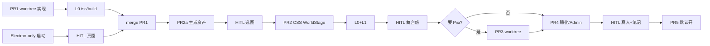

# World Stage + 产品交付：任务分配 / Subagent / Worktree / HITL

**日期**: 2026-07-30  
**状态**: 执行手册（配合 `docs/design/world-stage-atmosphere.md` Final Rev 2.2）  
**受众**: 编排 Agent（Grok）+ 人类 Owner  

---

## 1. 原则

| 原则 | 含义 |
|------|------|
| **设计已冻结再动代码** | 实现以 `world-stage-atmosphere.md` 为准；大方向变更先改设计再开 PR |
| **小 PR、可回滚** | 按设计 §20：PR1→PR2→PR2a→(门控 PR3)→PR4→PR5 |
| **默认 worktree 隔离有风险的改动** | 前端视觉 / 资产 / Electron 启动互不踩脚 |
| **HITL 卡在「不可逆或不可自动验」的节点** | 资产审美、默认开、Electron 真人窗体验 |
| **Subagent 给完整上下文** | 文件路径、验收标准、非目标、依赖 PR 写死在 prompt 里 |

---

## 2. 会如何分配任务

### 2.1 任务切片（按人/agent 可并行维度）

```text
轨道 A — DOM 结构（阻塞链头）
  PR1 固定 stage host

轨道 B — 资产（可与 A 后半 / PR2 平行）
  PR2a 生成 + QA + 入库 public/world

轨道 C — CSS WorldStage + flag
  PR2 依赖 PR1；可消费 PR2a 的 plate

轨道 D — Pixi（门控）
  PR3 仅产品确认 CSS 不够时

轨道 E — 交互抛光
  PR4 粒子/微光/Admin 开关

轨道 F — 默认开
  PR5 依赖 HITL 验收

轨道 G — 产品修复（本轮顺带）
  ContactList→DM；仅群气泡头像→资料；Electron-only 启动
```

### 2.2 角色分工

| 角色 | 做什么 | 不做什么 |
|------|--------|----------|
| **编排 Agent（主会话）** | 拆任务、spawn subagent、merge、HITL 提问、更新 AGENTS | 不一次改 5 个轨道 |
| **实现 Subagent** | 单 PR 范围内改代码 + 本地 typecheck/build + 自测清单 | 不擅自改设计文档大方向 |
| **资产 Subagent** | 按 §7 prompt 生成、写 manifest、体积检查 | 不把 `_source` 提交 git |
| **验收 Subagent** | Playwright/滚动断言、截图对比、读 electron.log | 不代替真人审美与默认开决策 |
| **人类 Owner（HITL）** | 选图、默认开、Electron 是否「真看见窗」、产品取舍 | 不手写全部分层代码 |

---

## 3. 如何调用 Subagent

### 3.1 通用模板

```text
spawn_subagent(
  subagent_type: general-purpose,
  description: "[impl] PR1 pin stage host",
  capability_mode: all,   # 或 worktree isolation
  isolation: "worktree",  # 见 §4
  prompt: """
    目标: <一句话>
    设计依据: docs/design/world-stage-atmosphere.md §X / PR N
    基线分支: main
    允许修改的文件: <白名单>
    禁止修改: <黑名单>
    验收标准:
      - [ ] ...
    完成后: commit（conventional）+ 报告 hash + 自测结果
    不要: 改无关重构、不要 force-push main
  """
)
```

### 3.2 本项目推荐的 Subagent 调用表

| ID | description 前缀 | 任务 | isolation | 等待 |
|----|------------------|------|-----------|------|
| S1 | `[impl] PR1 stage host` | ChatRoom/DM 固定层 | worktree | 完成后主会话 merge |
| S2 | `[assets] world plate` | Imagine + 入库 plate | worktree 或 main 仅 public/ | HITL 选图后 commit |
| S3 | `[impl] PR2 CSS stage` | WorldStage CSS + flag | worktree | 依赖 S1 merge |
| S4 | `[qa] scroll pin` | Playwright / 手工清单自动化 | read-only 或 shared | 不改业务逻辑 |
| S5 | `[impl] electron launch` | start-electron.ps1 加固 | 可 main 直接改 | 真人点窗 HITL |
| S6 | `[impl] PR3 Pixi` | **仅 HITL 批准后** | worktree | 门控 |

**并行规则：**

- **可并行**: S1 与 S2；S5 与 S1（文件几乎不撞）  
- **必须串行**: S3 等 S1；S4 验 S1+S3；S6 等 HITL + S3  
- **禁止**: 两个 agent 同时改 `ChatRoom.tsx` 无文件锁

### 3.3 Prompt 必含「验收命令」

```powershell
cd frontend; npx tsc --noEmit; npm run build
# Electron:
# stop.bat; start-electron.bat
# 期望: 黑窗 PASS 后出现 1200x780 窗；关窗端口 free
```

---

## 4. 要不要单独 Worktree？何时 merge？

### 4.1 建议默认：**要 worktree**

| 改动类型 | Worktree？ | 原因 |
|----------|------------|------|
| PR1 DOM 结构 | **是** | 动 ChatRoom/DM，易与别的 UI 冲突 |
| PR2 WorldStage | **是** | 新目录 + 接线 |
| PR2a 资产 | **可选** | 仅 `public/world` 时可用 main，冲突少 |
| Electron 启动脚本 | **可选** | 文件独立；紧急修复可 main |
| PR3 Pixi | **必须** | 依赖新增、体积风险、易污染 |
| 侧栏交互修复 | **可 main** | 小 diff、立刻要验证 |

### 4.2 Worktree 生命周期

```text
1. 主会话: git worktree add .worktree/pr1 -b feat/world-pr1
2. Subagent cwd = .worktree/pr1，完成 + commit
3. HITL 或自动验收（见 §5）
4. 主会话: checkout main; merge feat/world-pr1; worktree remove
5. 失败: 不 merge，保留分支供 diff，或 discard
```

### 4.3 验收后再合并的门槛

| 级别 | 门槛 | 适用 |
|------|------|------|
| **L0 自动** | tsc + build 绿；无冲突 | 所有 PR |
| **L1 脚本** | Playwright 滚动固定层；lifecycle stop 端口 free | PR1–PR2 |
| **L2 真人** | 看见 Electron 窗；壁纸/舞台不滚；侧栏进 DM | Electron、视觉 |
| **L3 产品** | 默认开、资产定稿 | PR5、PR2a 选图 |

**规则：L0 不过禁止 merge；L2 不过禁止宣称「Electron 修好」；L3 不过禁止 PR5。**

---

## 5. HITL（Human-in-the-Loop）节点

### 5.1 必须卡人的节点（Hard HITL）

| 节点 | 时机 | 人类看什么 | 通过标准 | 不通过则 |
|------|------|------------|----------|----------|
| **H1 资产选图** | PR2a 生成后、入库前 | plate 与分层是否「九洲」且够用 | Owner 点头 1 张主 plate | 重生成 / 换 prompt |
| **H2 Electron 真窗** | 启动脚本改完后 | 双击 `start-electron.bat` 是否弹出桌面窗 | 有窗 + 关窗清端口 | 修 launch，不进视觉 PR |
| **H3 舞台 vs 壁纸** | PR2 后 | 滚动消息时背景是否不动；是否够「舞台感」 | 固定 + 可读 | 调遮罩/图层或触发 PR3 讨论 |
| **H4 是否上 Pixi** | PR2 验收后 | CSS 是否已够「游戏舞台」 | 书面决定做/不做 PR3 | 跳过 PR3–4 粒子或弱化 |
| **H5 默认开** | PR5 前 | 真人试玩 + acceptance 笔记 | K15 双门禁 | 保持 flag 默认 off |

### 5.2 可不卡人的节点（Soft / 自动）

| 节点 | 谁验 |
|------|------|
| tsc / build | CI 或 subagent |
| flag `=== "1"` 语义 | 单测或代码审 |
| scroll pin Playwright | qa subagent |
| lifecycle 端口 stop | 脚本 |
| ContactList → DM 行为 | 快速手点或 e2e |

### 5.3 HITL 交互方式（编排 Agent）

1. **完成实现后**用截图 / 日志路径提问，不要空口「好了吗」  
2. 选项尽量 **通过 / 重做 / 改需求** 三选一  
3. 用户决策写入设计文档 Open Questions 冻结表（与 Rev 2.2 一致）  
4. **禁止** 在未 H2 时宣称 Electron 已修好  

### 5.4 推荐流水线时序（含 HITL）



---

## 6. 本轮已落地的产品修正（非 World Stage PR）

| 项 | 行为 |
|----|------|
| 左侧 ContactList 点角色 | **直接进私聊**（切换窗口） |
| 群聊消息气泡头像 | **弹出资料主页** |
| 右侧 GroupSidebar | **@ 提及**（不负责切窗） |
| 启动 | **仅** `start-electron.bat`（已删 browser 脚本） |

---

## 7. 编排 Agent 自检清单（每次开 PR 前）

- [ ] 是否引用了设计文档章节？  
- [ ] 文件白名单是否与其它 in-flight worktree 冲突？  
- [ ] 是否需要 worktree？  
- [ ] 验收是 L0 / L1 / L2 / L3 哪一级？  
- [ ] 本 PR 结束后是否必须 HITL？是哪一个 H#？  
- [ ] merge 后是否更新 AGENTS.md 一行状态？  

---

## 8. 一句话

> **用 worktree 做风险 PR，用 subagent 做单轨实现，用自动门挡质量，用 HITL 挡审美/默认开/真窗体验；侧栏只切窗，群气泡才弹主页，产品只保留 Electron 入口。**
